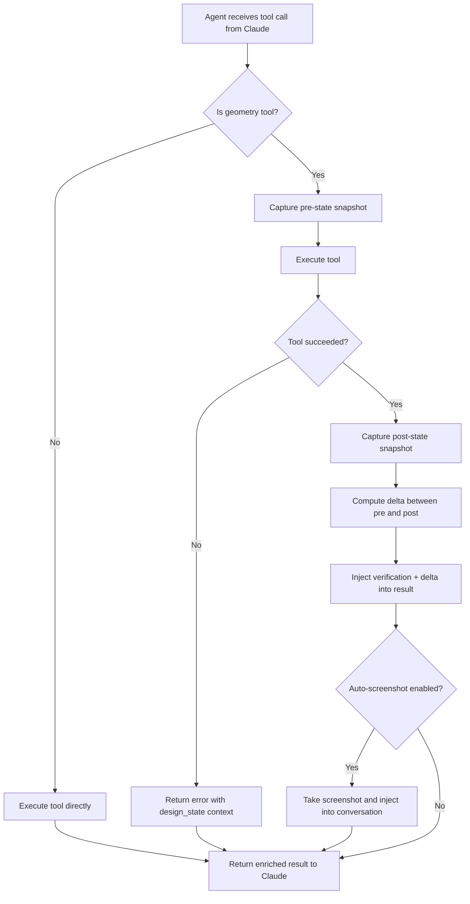
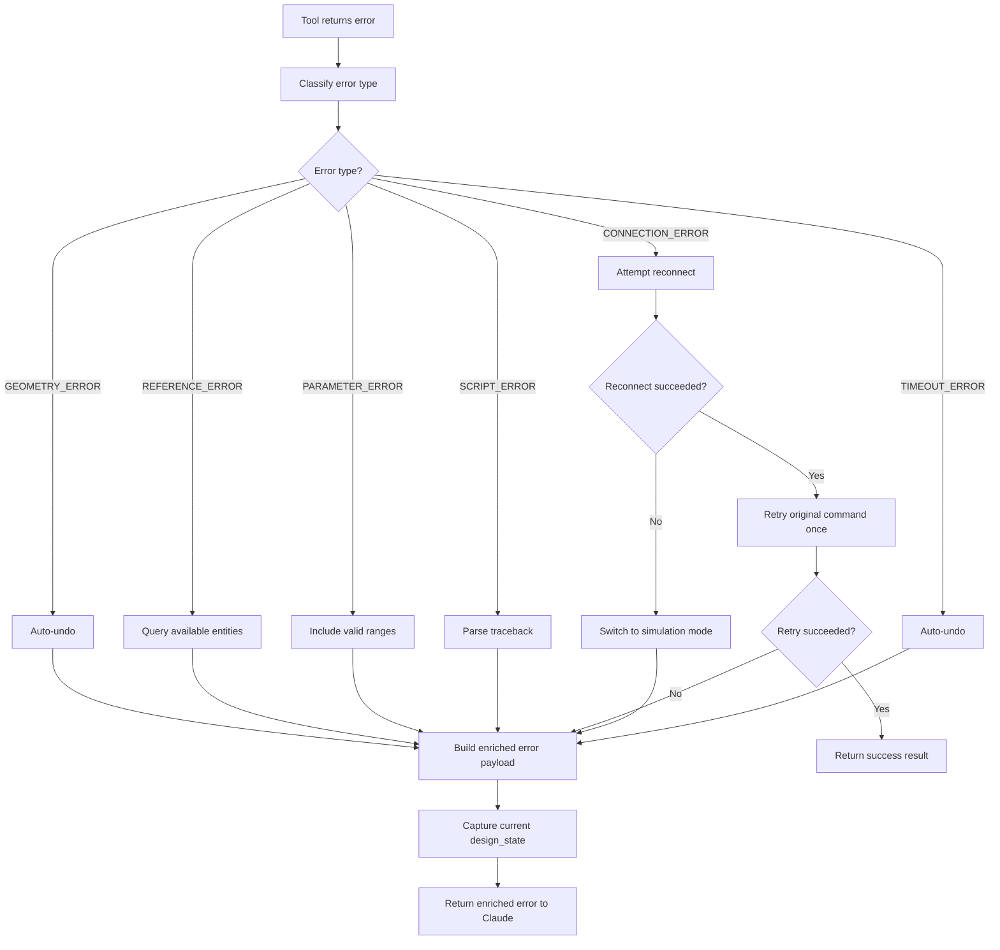
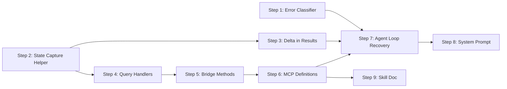

# Agent Intelligence Layer -- Design Document

> **Purpose:** Defines the verification loop, geometric data querying tools, and error
> recovery strategy for the Fusion 360 MCP Agent. This document is the authoritative
> specification that guides all implementation tasks for these three concerns.

---

## Table of Contents

1. [Verification Loop Protocol](#1-verification-loop-protocol)
2. [Geometric Data Tools Specification](#2-geometric-data-tools-specification)
3. [Error Recovery Strategy](#3-error-recovery-strategy)
4. [System Prompt Additions](#4-system-prompt-additions)
5. [Implementation Plan](#5-implementation-plan)

---

## 1. Verification Loop Protocol

### 1.1 Problem Statement

Today the agent receives a tool result with `"status": "success"` and a short message
string. It has no structured way to confirm that the geometry actually changed as
intended. The auto-screenshot in [`ClaudeClient`](ai/claude_client.py:65) injects a
viewport image after geometry tools, but images alone cannot confirm numeric properties
like volume, edge count, or dimensional accuracy.

### 1.2 Verification Workflow

Every geometry-modifying operation follows a three-phase protocol:

```
Phase 1: SNAPSHOT  -- Capture pre-operation state
Phase 2: EXECUTE   -- Run the tool
Phase 3: VERIFY    -- Compare post-operation state against expectations
```

#### Phase 1 -- Pre-Operation Snapshot

Before executing a geometry tool, the agent loop automatically captures a lightweight
state snapshot. This is **not** a screenshot -- it is a JSON object returned by
calling [`get_body_list`](mcp/server.py:104) and [`get_timeline`](mcp/server.py:486)
internally.

```json
{
  "pre_body_count": 3,
  "pre_timeline_length": 8,
  "pre_body_names": ["Base", "Bracket", "Pin"]
}
```

This snapshot is captured by the agent loop code in [`_run_turn`](ai/claude_client.py:329)
before dispatching the tool call.

#### Phase 2 -- Execute with Enhanced Results

The tool executes normally. The result payload is enriched by the add-in to include
delta information (see section 1.4).

#### Phase 3 -- Post-Operation Verification

After receiving the tool result, the agent loop compares the post-state against the
pre-state snapshot and injects a verification summary into the tool result before
Claude sees it.

```json
{
  "status": "success",
  "message": "Created cylinder r=2.5 h=10.0",
  "verification": {
    "body_count_before": 3,
    "body_count_after": 4,
    "bodies_added": ["Body4"],
    "bodies_removed": [],
    "timeline_length_before": 8,
    "timeline_length_after": 10,
    "new_body_bounding_box": {
      "min": [-2.5, -2.5, 0.0],
      "max": [2.5, 2.5, 10.0]
    }
  }
}
```

### 1.3 Verification Matrix by Tool Category

| Tool Category | What to Verify | Method |
|---------------|---------------|--------|
| **Primitives** -- `create_box`, `create_cylinder`, `create_sphere` | Body count increased by 1; new body bounding box matches expected dimensions | `get_body_list` before/after diff |
| **Sketch creation** -- `create_sketch`, `add_sketch_*` | Sketch exists; curve count increased; profile count for closed geometry | `get_sketch_info` after |
| **Extrude / Revolve** | Body count changed per operation type; bounding box of affected body | `get_body_list` + `get_body_properties` |
| **Fillet / Chamfer** | Edge count changed on target body; feature appears in timeline | `get_body_properties` before/after |
| **Mirror** | Body count increased by 1; mirrored body bounding box is symmetric | `get_body_list` diff |
| **Export** | `file_size_bytes > 0` in result | Already in result payload |
| **execute_script** | `success: true` and `stderr` is empty; optionally parse stdout for assertions | Result payload |
| **Boolean ops** -- extrude with `cut`/`join`/`intersect` | Body count changed correctly; volume changed in expected direction | `get_body_properties` volume comparison |

### 1.4 Verification-Aware Tool Results

Every geometry-modifying handler in [`addin_server.py`](fusion_addin/addin_server.py:193)
will be enhanced to capture state before and after the operation and include a `delta`
object in the response:

```json
{
  "status": "success",
  "message": "Created cylinder r=2.5 h=10.0",
  "delta": {
    "bodies_before": 3,
    "bodies_after": 4,
    "timeline_before": 8,
    "timeline_after": 10,
    "affected_body": {
      "name": "Body4",
      "volume_cm3": 196.35,
      "bounding_box": {
        "min": [-2.5, -2.5, 0.0],
        "max": [2.5, 2.5, 10.0]
      },
      "face_count": 3,
      "edge_count": 2,
      "vertex_count": 0
    }
  }
}
```

The `delta` object is computed by a shared helper method
`_capture_design_state()` / `_compute_delta(before, after)` added to
[`_ExecuteEventHandler`](fusion_addin/addin_server.py:174).

### 1.5 When to Use Screenshots vs Data Queries

| Situation | Use Screenshot | Use Data Query |
|-----------|:-:|:-:|
| Verify a box was created with correct dimensions | | [x] |
| Check visual alignment of multiple parts | [x] | |
| Confirm fillet radius looks correct | [x] | |
| Verify body count after boolean operation | | [x] |
| Check complex script output | [x] | [x] |
| Verify export completed | | [x] |
| Debug why a feature failed | [x] | [x] |

**Rule of thumb:** Use data queries for quantitative verification. Use screenshots for
qualitative / spatial-relationship verification. Use both when debugging failures.

### 1.6 Verification Flow Diagram



---

## 2. Geometric Data Tools Specification

### 2.1 Overview

Six new tools extend the agent's ability to query the design state. These are
**read-only** tools -- they do not modify geometry. They appear in a new
`"Query"` category in [`TOOL_CATEGORIES`](mcp/server.py:522).

### 2.2 Tool: `get_body_properties`

Returns detailed geometric and physical properties for a single body.

**MCP Tool Schema:**

```json
{
  "name": "get_body_properties",
  "description": "Get detailed geometric and physical properties of a specific body, including face/edge/vertex counts, volume, surface area, center of mass, and bounding box.",
  "input_schema": {
    "type": "object",
    "properties": {
      "body_name": {
        "type": "string",
        "description": "Name of the body to query."
      }
    },
    "required": ["body_name"]
  }
}
```

**Return Schema:**

```json
{
  "status": "success",
  "success": true,
  "body": {
    "name": "Body1",
    "component": "Root",
    "is_visible": true,
    "is_solid": true,
    "volume_cm3": 196.35,
    "surface_area_cm2": 235.62,
    "center_of_mass": [0.0, 0.0, 5.0],
    "bounding_box": {
      "min": [-2.5, -2.5, 0.0],
      "max": [2.5, 2.5, 10.0]
    },
    "face_count": 3,
    "edge_count": 2,
    "vertex_count": 0,
    "material": "Steel",
    "appearance": "Steel - Satin"
  }
}
```

**Fusion API Implementation Notes:**

```python
# In _ExecuteEventHandler
def _handle_get_body_properties(self, p) -> dict:
    body = self._find_body(p["body_name"])
    comp = body.parentComponent

    # Physical properties
    phys = body.physicalProperties
    # phys.volume -> cm^3
    # phys.area -> cm^2
    # phys.centerOfMass -> Point3D

    result_body = {
        "name": body.name,
        "component": comp.name,
        "is_visible": body.isVisible,
        "is_solid": body.isSolid,
        "volume_cm3": phys.volume,
        "surface_area_cm2": phys.area,
        "center_of_mass": [
            phys.centerOfMass.x,
            phys.centerOfMass.y,
            phys.centerOfMass.z
        ],
        "bounding_box": {
            "min": [body.boundingBox.minPoint.x,
                    body.boundingBox.minPoint.y,
                    body.boundingBox.minPoint.z],
            "max": [body.boundingBox.maxPoint.x,
                    body.boundingBox.maxPoint.y,
                    body.boundingBox.maxPoint.z]
        },
        "face_count": body.faces.count,
        "edge_count": body.edges.count,
        "vertex_count": body.vertices.count,
        "material": body.material.name if body.material else None,
        "appearance": body.appearance.name if body.appearance else None,
    }
    return {"status": "success", "success": True, "body": result_body}
```

### 2.3 Tool: `get_sketch_info`

Returns detailed information about a sketch including curves, profiles, and constraints.

**MCP Tool Schema:**

```json
{
  "name": "get_sketch_info",
  "description": "Get detailed information about a sketch including its curves, profiles, dimensions, and constraint status. Use this to verify sketch geometry before extruding.",
  "input_schema": {
    "type": "object",
    "properties": {
      "sketch_name": {
        "type": "string",
        "description": "Name of the sketch to query."
      }
    },
    "required": ["sketch_name"]
  }
}
```

**Return Schema:**

```json
{
  "status": "success",
  "success": true,
  "sketch": {
    "name": "Sketch1",
    "plane": "XY",
    "is_visible": true,
    "is_fully_constrained": true,
    "profile_count": 1,
    "curve_count": 4,
    "constraint_count": 8,
    "dimension_count": 2,
    "curves": [
      {
        "index": 0,
        "type": "SketchLine",
        "start": [0.0, 0.0],
        "end": [5.0, 0.0],
        "length": 5.0
      },
      {
        "index": 1,
        "type": "SketchCircle",
        "center": [2.5, 2.5],
        "radius": 1.0
      },
      {
        "index": 2,
        "type": "SketchArc",
        "center": [0.0, 0.0],
        "radius": 3.0,
        "start_angle_deg": 0.0,
        "end_angle_deg": 90.0
      }
    ],
    "profiles": [
      {
        "index": 0,
        "area_cm2": 25.0,
        "is_outer": true
      }
    ],
    "dimensions": [
      {
        "name": "d1",
        "value": 5.0,
        "expression": "5 cm"
      }
    ]
  }
}
```

**Fusion API Implementation Notes:**

```python
def _handle_get_sketch_info(self, p) -> dict:
    sketch = self._find_sketch(p["sketch_name"])

    # Determine plane
    plane_name = "Unknown"
    ref_plane = sketch.referencePlane
    root = self._root()
    if ref_plane == root.xYConstructionPlane:
        plane_name = "XY"
    elif ref_plane == root.xZConstructionPlane:
        plane_name = "XZ"
    elif ref_plane == root.yZConstructionPlane:
        plane_name = "YZ"

    # Collect curves
    curves = []
    for i in range(sketch.sketchCurves.count):
        curve = sketch.sketchCurves.item(i)
        curve_info = {"index": i, "type": curve.objectType.split("::")[-1]}

        if hasattr(curve, "startSketchPoint") and hasattr(curve, "endSketchPoint"):
            curve_info["start"] = [
                curve.startSketchPoint.geometry.x,
                curve.startSketchPoint.geometry.y
            ]
            curve_info["end"] = [
                curve.endSketchPoint.geometry.x,
                curve.endSketchPoint.geometry.y
            ]
        if hasattr(curve, "length"):
            curve_info["length"] = curve.length
        if hasattr(curve, "radius"):
            curve_info["radius"] = curve.radius
        if hasattr(curve, "centerSketchPoint"):
            curve_info["center"] = [
                curve.centerSketchPoint.geometry.x,
                curve.centerSketchPoint.geometry.y
            ]
        curves.append(curve_info)

    # Collect profiles
    profiles = []
    for i in range(sketch.profiles.count):
        prof = sketch.profiles.item(i)
        props = prof.areaProperties()
        profiles.append({
            "index": i,
            "area_cm2": props.area,
            "is_outer": i == 0  # heuristic: first profile is typically outermost
        })

    # Collect dimensions
    dimensions = []
    for i in range(sketch.sketchDimensions.count):
        dim = sketch.sketchDimensions.item(i)
        dimensions.append({
            "name": dim.parameter.name if dim.parameter else f"dim_{i}",
            "value": dim.parameter.value if dim.parameter else 0,
            "expression": dim.parameter.expression if dim.parameter else ""
        })

    return {
        "status": "success",
        "success": True,
        "sketch": {
            "name": sketch.name,
            "plane": plane_name,
            "is_visible": sketch.isVisible,
            "is_fully_constrained": sketch.isFullyConstrained
                if hasattr(sketch, "isFullyConstrained") else None,
            "profile_count": sketch.profiles.count,
            "curve_count": sketch.sketchCurves.count,
            "constraint_count": sketch.geometricConstraints.count,
            "dimension_count": sketch.sketchDimensions.count,
            "curves": curves,
            "profiles": profiles,
            "dimensions": dimensions,
        }
    }
```

### 2.4 Tool: `measure_distance`

Measures the minimum distance between two named entities.

**MCP Tool Schema:**

```json
{
  "name": "measure_distance",
  "description": "Measure the minimum distance between two entities. Entities can be bodies, faces, or edges identified by body_name and optional face/edge index.",
  "input_schema": {
    "type": "object",
    "properties": {
      "entity1": {
        "type": "object",
        "description": "First entity reference.",
        "properties": {
          "body_name": { "type": "string" },
          "face_index": { "type": "integer" },
          "edge_index": { "type": "integer" }
        },
        "required": ["body_name"]
      },
      "entity2": {
        "type": "object",
        "description": "Second entity reference.",
        "properties": {
          "body_name": { "type": "string" },
          "face_index": { "type": "integer" },
          "edge_index": { "type": "integer" }
        },
        "required": ["body_name"]
      }
    },
    "required": ["entity1", "entity2"]
  }
}
```

**Return Schema:**

```json
{
  "status": "success",
  "success": true,
  "distance_cm": 3.75,
  "point1": [1.0, 2.0, 3.0],
  "point2": [4.0, 5.0, 6.0]
}
```

**Fusion API Implementation Notes:**

```python
def _handle_measure_distance(self, p) -> dict:
    e1_ref = p["entity1"]
    e2_ref = p["entity2"]

    entity1 = self._resolve_entity(e1_ref)
    entity2 = self._resolve_entity(e2_ref)

    measMgr = self._app.measureManager
    result = measMgr.measureMinimumDistance(entity1, entity2)

    return {
        "status": "success",
        "success": True,
        "distance_cm": result.value,
        "point1": [result.pointOne.x, result.pointOne.y, result.pointOne.z],
        "point2": [result.pointTwo.x, result.pointTwo.y, result.pointTwo.z],
    }

def _resolve_entity(self, ref: dict):
    """Resolve an entity reference dict to a Fusion API object."""
    body = self._find_body(ref["body_name"])
    if "face_index" in ref:
        idx = ref["face_index"]
        if idx >= body.faces.count:
            raise RuntimeError(
                f"Face index {idx} out of range -- body has {body.faces.count} faces."
            )
        return body.faces.item(idx)
    if "edge_index" in ref:
        idx = ref["edge_index"]
        if idx >= body.edges.count:
            raise RuntimeError(
                f"Edge index {idx} out of range -- body has {body.edges.count} edges."
            )
        return body.edges.item(idx)
    return body
```

### 2.5 Tool: `get_component_info`

Returns the component tree with nested components, bodies, sketches, and features.

**MCP Tool Schema:**

```json
{
  "name": "get_component_info",
  "description": "Get detailed information about a component including its bodies, sketches, features, and child components. Omit component_name to query the root component.",
  "input_schema": {
    "type": "object",
    "properties": {
      "component_name": {
        "type": "string",
        "description": "Name of the component to query. Omit for root component."
      }
    },
    "required": []
  }
}
```

**Return Schema:**

```json
{
  "status": "success",
  "success": true,
  "component": {
    "name": "Root",
    "is_root": true,
    "bodies": [
      { "name": "Body1", "is_visible": true, "volume_cm3": 125.0 }
    ],
    "sketches": [
      { "name": "Sketch1", "profile_count": 1, "is_visible": false }
    ],
    "features": [
      { "name": "Extrusion1", "type": "ExtrudeFeature", "is_suppressed": false }
    ],
    "child_components": [
      { "name": "Bracket", "body_count": 2, "occurrence_count": 1 }
    ],
    "construction_planes": ["XY", "XZ", "YZ"],
    "parameters": [
      { "name": "wall_thickness", "value": 0.2, "expression": "2 mm", "unit": "cm" }
    ]
  }
}
```

### 2.6 Tool: `validate_design`

Runs a design health check and reports issues.

**MCP Tool Schema:**

```json
{
  "name": "validate_design",
  "description": "Validate the current design for common issues including non-manifold geometry, open boundaries, small edges, and other problems that could cause manufacturing or export failures.",
  "input_schema": {
    "type": "object",
    "properties": {},
    "required": []
  }
}
```

**Return Schema:**

```json
{
  "status": "success",
  "success": true,
  "valid": false,
  "body_count": 4,
  "total_volume_cm3": 523.6,
  "issues": [
    {
      "severity": "warning",
      "type": "small_edge",
      "description": "Edge on Body2 is shorter than 0.001 cm",
      "body_name": "Body2",
      "entity_index": 5
    },
    {
      "severity": "error",
      "type": "non_manifold",
      "description": "Body3 contains non-manifold edges",
      "body_name": "Body3"
    }
  ],
  "summary": "4 bodies, 1 error, 1 warning"
}
```

**Fusion API Implementation Notes:**

The validation checks are implemented by iterating over all bodies and inspecting:

- `body.isSolid` -- `false` indicates open/non-manifold geometry
- `body.edges` with `edge.length < threshold` -- detects small edges
- `body.faces` with `face.area < threshold` -- detects small/sliver faces
- `body.volume < threshold` -- detects near-zero-volume bodies

```python
def _handle_validate_design(self, p) -> dict:
    design = adsk.fusion.Design.cast(self._app.activeProduct)
    if not design:
        return {"status": "error", "message": "No active design."}

    issues = []
    total_volume = 0.0
    body_count = 0

    SMALL_EDGE = 0.001   # cm
    SMALL_FACE = 0.0001  # cm^2

    for comp in design.allComponents:
        for i in range(comp.bRepBodies.count):
            body = comp.bRepBodies.item(i)
            body_count += 1
            total_volume += body.physicalProperties.volume

            if not body.isSolid:
                issues.append({
                    "severity": "error",
                    "type": "non_solid",
                    "description": f"{body.name} is not a solid body -- may have open boundaries",
                    "body_name": body.name,
                })

            for ei in range(body.edges.count):
                edge = body.edges.item(ei)
                if edge.length < SMALL_EDGE:
                    issues.append({
                        "severity": "warning",
                        "type": "small_edge",
                        "description": f"Edge {ei} on {body.name} is {edge.length:.6f} cm -- shorter than threshold",
                        "body_name": body.name,
                        "entity_index": ei,
                    })

            for fi in range(body.faces.count):
                face = body.faces.item(fi)
                if face.area < SMALL_FACE:
                    issues.append({
                        "severity": "warning",
                        "type": "small_face",
                        "description": f"Face {fi} on {body.name} has area {face.area:.6f} cm^2 -- below threshold",
                        "body_name": body.name,
                        "entity_index": fi,
                    })

    errors = sum(1 for i in issues if i["severity"] == "error")
    warnings = sum(1 for i in issues if i["severity"] == "warning")

    return {
        "status": "success",
        "success": True,
        "valid": len([i for i in issues if i["severity"] == "error"]) == 0,
        "body_count": body_count,
        "total_volume_cm3": total_volume,
        "issues": issues,
        "summary": f"{body_count} bodies, {errors} errors, {warnings} warnings",
    }
```

### 2.7 Tool: `get_face_info`

Returns information about a specific face on a body.

**MCP Tool Schema:**

```json
{
  "name": "get_face_info",
  "description": "Get detailed information about a specific face on a body, including its area, surface type, normal vector, and bounding box.",
  "input_schema": {
    "type": "object",
    "properties": {
      "body_name": {
        "type": "string",
        "description": "Name of the body containing the face."
      },
      "face_index": {
        "type": "integer",
        "description": "Index of the face in the body's face collection."
      }
    },
    "required": ["body_name", "face_index"]
  }
}
```

**Return Schema:**

```json
{
  "status": "success",
  "success": true,
  "face": {
    "index": 0,
    "body_name": "Body1",
    "area_cm2": 25.0,
    "surface_type": "Plane",
    "normal": [0.0, 0.0, 1.0],
    "bounding_box": {
      "min": [0.0, 0.0, 5.0],
      "max": [5.0, 5.0, 5.0]
    },
    "edge_count": 4,
    "is_planar": true
  }
}
```

**Fusion API Implementation Notes:**

```python
def _handle_get_face_info(self, p) -> dict:
    body = self._find_body(p["body_name"])
    idx = int(p["face_index"])
    if idx >= body.faces.count:
        return {
            "status": "error",
            "message": f"Face index {idx} out of range -- body has {body.faces.count} faces."
        }

    face = body.faces.item(idx)
    geom = face.geometry

    # Surface type mapping
    type_map = {
        adsk.core.SurfaceTypes.PlaneSurfaceType: "Plane",
        adsk.core.SurfaceTypes.CylinderSurfaceType: "Cylinder",
        adsk.core.SurfaceTypes.ConeSurfaceType: "Cone",
        adsk.core.SurfaceTypes.SphereSurfaceType: "Sphere",
        adsk.core.SurfaceTypes.TorusSurfaceType: "Torus",
        adsk.core.SurfaceTypes.NurbsSurfaceType: "NURBS",
    }
    surface_type = type_map.get(geom.surfaceType, "Unknown")

    # Normal at centroid for planar faces
    normal = None
    is_planar = geom.surfaceType == adsk.core.SurfaceTypes.PlaneSurfaceType
    if is_planar:
        normal = [geom.normal.x, geom.normal.y, geom.normal.z]
    else:
        # Evaluate at mid-parameter
        evaluator = face.evaluator
        ret_val, param = evaluator.getParameterAtPoint(face.pointOnFace)
        if ret_val:
            ret_val2, normal_vec = evaluator.getNormalAtParameter(param)
            if ret_val2:
                normal = [normal_vec.x, normal_vec.y, normal_vec.z]

    bb = face.boundingBox
    return {
        "status": "success",
        "success": True,
        "face": {
            "index": idx,
            "body_name": body.name,
            "area_cm2": face.area,
            "surface_type": surface_type,
            "normal": normal,
            "bounding_box": {
                "min": [bb.minPoint.x, bb.minPoint.y, bb.minPoint.z],
                "max": [bb.maxPoint.x, bb.maxPoint.y, bb.maxPoint.z],
            } if bb else None,
            "edge_count": face.edges.count,
            "is_planar": is_planar,
        }
    }
```

### 2.8 Tool Summary Table

| Tool | Category | Parameters | Primary Use |
|------|----------|-----------|-------------|
| `get_body_properties` | Query | `body_name` | Verify body dimensions, topology counts |
| `get_sketch_info` | Query | `sketch_name` | Verify sketch geometry before feature ops |
| `get_face_info` | Query | `body_name`, `face_index` | Inspect individual faces for type, normal, area |
| `measure_distance` | Query | `entity1`, `entity2` | Measure gaps, clearances, alignment |
| `get_component_info` | Query | `component_name?` | Explore design tree, find entities |
| `validate_design` | Query | *(none)* | Health check before export or after complex ops |

---

## 3. Error Recovery Strategy

### 3.1 Error Classification

All errors are classified into one of seven types. The classification is determined
by pattern-matching the error message and/or the context of the failure.

| Error Type | Code | Description | Examples |
|-----------|------|-------------|----------|
| `GEOMETRY_ERROR` | `GE` | Feature creation failed due to geometric invalidity | Self-intersecting extrude, fillet radius too large, no profile found |
| `REFERENCE_ERROR` | `RE` | Named entity not found | Body/sketch/face name incorrect, entity was deleted |
| `PARAMETER_ERROR` | `PE` | Invalid parameter value | Negative radius, zero distance, angle out of range |
| `SCRIPT_ERROR` | `SE` | Python syntax or runtime error in `execute_script` | SyntaxError, NameError, AttributeError in user script |
| `CONNECTION_ERROR` | `CE` | TCP bridge communication failure | Socket timeout, connection refused, connection closed |
| `API_ERROR` | `AE` | Anthropic API failure | Rate limit, auth error, server error |
| `TIMEOUT_ERROR` | `TE` | Operation exceeded time limit | Complex script, heavy geometry computation |

### 3.2 Error Classification Logic

Implemented as a function in the agent loop or as a utility module:

```python
# ai/error_classifier.py

import re

class ErrorType:
    GEOMETRY_ERROR   = "GEOMETRY_ERROR"
    REFERENCE_ERROR  = "REFERENCE_ERROR"
    PARAMETER_ERROR  = "PARAMETER_ERROR"
    SCRIPT_ERROR     = "SCRIPT_ERROR"
    CONNECTION_ERROR = "CONNECTION_ERROR"
    API_ERROR        = "API_ERROR"
    TIMEOUT_ERROR    = "TIMEOUT_ERROR"

# Pattern -> error type mapping
_PATTERNS = [
    (r"(?i)not found|does not exist|no .* named",  ErrorType.REFERENCE_ERROR),
    (r"(?i)out of range|invalid .* value|negative|must be positive|cannot be zero",
                                                     ErrorType.PARAMETER_ERROR),
    (r"(?i)self.intersect|non.manifold|feature failed|no profile|profile .* out of range",
                                                     ErrorType.GEOMETRY_ERROR),
    (r"(?i)timeout|timed out",                       ErrorType.TIMEOUT_ERROR),
    (r"(?i)socket|connection|refused|closed by",     ErrorType.CONNECTION_ERROR),
    (r"(?i)SyntaxError|NameError|TypeError|AttributeError|IndentationError|traceback",
                                                     ErrorType.SCRIPT_ERROR),
]

def classify_error(error_message: str, tool_name: str = "") -> str:
    """Classify an error message into an ErrorType."""
    for pattern, error_type in _PATTERNS:
        if re.search(pattern, error_message):
            return error_type

    # Fallback by tool name
    if tool_name == "execute_script":
        return ErrorType.SCRIPT_ERROR

    return ErrorType.GEOMETRY_ERROR  # default for unknown tool errors
```

### 3.3 Enhanced Error Payload

Every error result from tool execution is enriched with structured metadata:

```json
{
  "success": false,
  "status": "error",
  "error_type": "GEOMETRY_ERROR",
  "error": "Feature failed: self-intersecting geometry",
  "error_details": {
    "operation": "extrude",
    "tool_name": "extrude",
    "tool_input": {
      "sketch_name": "Sketch1",
      "distance": 5.0,
      "operation": "cut"
    },
    "suggestion": "Check sketch profiles for overlapping geometry. Verify the extrusion direction intersects an existing body for cut operations.",
    "auto_recovered": true,
    "recovery_action": "undo",
    "valid_ranges": null
  },
  "design_state": {
    "body_count": 3,
    "timeline_position": 12,
    "body_names": ["Base", "Bracket", "Pin"]
  }
}
```

### 3.4 Auto-Recovery Matrix

| Error Type | Auto-Recovery Action | Implemented In |
|-----------|---------------------|----------------|
| `GEOMETRY_ERROR` | Call `undo` to revert partial changes; include error details and suggestion | [`claude_client.py`](ai/claude_client.py) agent loop |
| `REFERENCE_ERROR` | No undo needed; include list of available entity names | [`claude_client.py`](ai/claude_client.py) agent loop |
| `PARAMETER_ERROR` | No undo needed; include valid ranges in error message | [`addin_server.py`](fusion_addin/addin_server.py) handler |
| `SCRIPT_ERROR` | Parse traceback for line number and error type; include in error details | [`addin_server.py`](fusion_addin/addin_server.py) `_execute_script` |
| `CONNECTION_ERROR` | Attempt reconnect once; if fail, switch to simulation mode | [`bridge.py`](fusion/bridge.py) `_send_command` |
| `API_ERROR` | Handled by existing [`_run_turn`](ai/claude_client.py:329) exception handlers | [`claude_client.py`](ai/claude_client.py) |
| `TIMEOUT_ERROR` | Call `undo` as a precaution; suggest simplifying the operation | [`claude_client.py`](ai/claude_client.py) agent loop |

### 3.5 Auto-Recovery Flow



### 3.6 Suggestion Generation

Each error type has a set of canned suggestion templates:

```python
_SUGGESTIONS = {
    ErrorType.GEOMETRY_ERROR: {
        "extrude": "Check that the sketch has a valid closed profile. For cut operations, verify the extrusion direction intersects an existing body.",
        "add_fillet": "The fillet radius may be too large for the selected edges. Try a smaller radius or fewer edges.",
        "add_chamfer": "The chamfer distance may exceed the edge length. Try a smaller distance.",
        "revolve": "Ensure the sketch profile is entirely on one side of the revolution axis.",
        "create_sphere": "Check that the radius is positive and the position does not conflict with existing geometry.",
        "_default": "The geometry operation failed. Try undoing, simplifying the geometry, and retrying.",
    },
    ErrorType.REFERENCE_ERROR: {
        "_default": "The referenced entity was not found. Use get_body_list, get_sketch_info, or get_component_info to find valid entity names.",
    },
    ErrorType.PARAMETER_ERROR: {
        "_default": "One or more parameter values are invalid. All dimensions must be positive numbers in centimeters. Angles must be in the valid range.",
    },
    ErrorType.SCRIPT_ERROR: {
        "_default": "The Python script has a syntax or runtime error. Check the traceback for the line number and error message, fix the code, and re-execute.",
    },
    ErrorType.TIMEOUT_ERROR: {
        "_default": "The operation timed out. Try simplifying the geometry or breaking the operation into smaller steps.",
    },
}
```

### 3.7 Retry Logic in the Agent Loop

The retry mechanism is built into [`_run_turn`](ai/claude_client.py:329) as a wrapper
around tool execution. It is **not** an infinite retry -- it applies structured rules:

```python
MAX_RETRIES_PER_TOOL = 1  # auto-retry once for CONNECTION_ERROR only

def _execute_with_recovery(self, tool_name, tool_input):
    """Execute a tool with error classification and auto-recovery."""
    # Capture pre-state for geometry tools
    pre_state = None
    if tool_name in GEOMETRY_TOOLS:
        pre_state = self._capture_design_state()

    # Execute
    result = self.mcp_server.execute_tool(tool_name, tool_input)

    # Check for error
    if self._is_error(result):
        error_msg = result.get("message", "") or result.get("error", "")
        error_type = classify_error(error_msg, tool_name)

        # Auto-recovery
        recovery_action = None
        if error_type in (ErrorType.GEOMETRY_ERROR, ErrorType.TIMEOUT_ERROR):
            self.mcp_server.execute_tool("undo", {})
            recovery_action = "undo"
        elif error_type == ErrorType.REFERENCE_ERROR:
            # Enrich with available names
            body_list = self.mcp_server.execute_tool("get_body_list", {})
            result["available_bodies"] = body_list.get("bodies", [])
        elif error_type == ErrorType.CONNECTION_ERROR:
            # Try reconnect + retry once
            self.mcp_server.bridge.connect()
            if not self.mcp_server.bridge.simulation_mode:
                result = self.mcp_server.execute_tool(tool_name, tool_input)
                if not self._is_error(result):
                    return result
                recovery_action = "reconnect_failed"

        # Build enriched error
        result["error_type"] = error_type
        result["error_details"] = {
            "operation": tool_name,
            "tool_name": tool_name,
            "tool_input": tool_input,
            "suggestion": self._get_suggestion(error_type, tool_name),
            "auto_recovered": recovery_action is not None,
            "recovery_action": recovery_action,
        }
        result["design_state"] = self._capture_design_state()

    return result
```

### 3.8 System Prompt Retry Instructions

Claude is instructed via the system prompt to handle errors with a structured retry
strategy (see section 4 for the exact text). The key rules:

1. **Maximum 3 attempts** per operation before asking the user for help
2. **Escalation path:** predefined tool --> custom script --> ask user
3. **Always examine the error** before retrying -- do not blindly retry the same inputs
4. **For SCRIPT_ERROR:** parse the traceback, identify the failing line, fix, re-execute
5. **For GEOMETRY_ERROR:** query the current state, understand why it failed, modify approach

---

## 4. System Prompt Additions

The following text is added to [`CORE_IDENTITY`](ai/system_prompt.py:20) in
[`ai/system_prompt.py`](ai/system_prompt.py). It is appended after the existing
`## Communication Style` section.

```
## Verification Protocol

After every geometry-modifying operation, you MUST verify the result:

1. **Check the delta:** Every geometry tool result includes a `delta` object showing
   body count before/after, timeline changes, and affected body properties. Read this
   first -- if the body count did not change as expected, something went wrong.

2. **Use data queries for numeric verification:**
   - After creating geometry: call `get_body_properties` to verify volume and bounding
     box match your expectations.
   - After sketch operations: call `get_sketch_info` to verify profile count and curve
     geometry before extruding.
   - After fillet/chamfer: call `get_body_properties` to confirm edge count changed.
   - After export: check `file_size_bytes` in the result -- must be > 0.

3. **Use screenshots for visual verification:**
   - After complex multi-step operations to check spatial relationships.
   - When the user asks "does this look right?" or similar.
   - When debugging a failed operation.
   - Auto-screenshots are taken after geometry tools; review them for obvious issues.

4. **Compare before and after:**
   - The tool result `delta` provides pre/post counts automatically.
   - For critical dimensions, call `get_body_properties` before and after, then
     compare volume, face count, or bounding box.
   - For boolean operations (cut/join), verify volume changed in the expected direction.

5. **Validate before export:**
   - Call `validate_design` before exporting to STL/STEP to catch issues early.
   - Fix any errors (non-solid bodies, small edges) before exporting.

## Geometric Data Querying

You have access to query tools that provide detailed numeric information about the
design. Use these proactively, not just for verification:

- **`get_body_properties`** -- Get face/edge/vertex counts, volume, surface area,
  center of mass, bounding box for a specific body. Use this to understand existing
  geometry before modifying it.
- **`get_sketch_info`** -- Get curves, profiles, dimensions, constraint status for
  a sketch. Always check this before extruding to ensure profiles are closed.
- **`get_face_info`** -- Get area, surface type (planar/cylindrical/etc.), normal
  vector for a face. Useful for finding the right face for operations like shell.
- **`measure_distance`** -- Measure minimum distance between entities. Use for
  clearance checks and alignment verification.
- **`get_component_info`** -- Get the full component tree. Use to explore the design
  structure and find entity names.
- **`validate_design`** -- Run a health check on all bodies. Use before export and
  after complex operations.

**When to query vs. when to screenshot:**
- Need a number (volume, distance, count)? --> Query tool.
- Need to see spatial relationships? --> Screenshot.
- Debugging a failure? --> Both.

## Error Recovery

When a tool call fails, follow this structured recovery process:

1. **Read the error carefully.** The error result includes:
   - `error_type` -- classification of what went wrong
   - `error_details.suggestion` -- specific advice for this error
   - `design_state` -- current body count and timeline position
   - For GEOMETRY_ERROR: the operation was auto-undone
   - For REFERENCE_ERROR: `available_bodies` lists valid entity names

2. **Diagnose before retrying.** Do NOT blindly retry the same operation. Instead:
   - For GEOMETRY_ERROR: Query the sketch or body to understand the problem. Check
     profile count, verify dimensions, look for self-intersections.
   - For REFERENCE_ERROR: Use the `available_bodies` list or call `get_body_list`
     / `get_component_info` to find the correct entity name.
   - For PARAMETER_ERROR: Check the valid ranges in the error message. Ensure all
     values are positive and in centimeters.
   - For SCRIPT_ERROR: Parse the traceback -- find the line number, the error type,
     and fix the specific issue in the code.

3. **Retry with modifications.** After diagnosing:
   - Adjust parameters (smaller fillet radius, different extrusion direction, etc.)
   - Fix entity references (correct body name, valid edge indices, etc.)
   - Simplify geometry if the approach is fundamentally problematic

4. **Escalation path:**
   - First: try the predefined MCP tool with corrected parameters
   - Second: write a custom `execute_script` that handles the edge case
   - Third: after 3 failed attempts, explain the problem to the user and ask for
     guidance

5. **Never leave broken state.** If an operation fails:
   - GEOMETRY_ERROR is auto-undone -- verify by checking body count
   - For scripts that partially succeeded, manually undo if needed
   - Call `get_body_list` to confirm the design is in a clean state before proceeding
```

---

## 5. Implementation Plan

### 5.1 Ordered Implementation Steps

Each step is a discrete, independently testable unit of work.

#### Step 1: Error Classification Module

Create the error classification utility.

| Item | Value |
|------|-------|
| **New file** | `ai/error_classifier.py` |
| **Contents** | `ErrorType` enum, `classify_error()` function, `_SUGGESTIONS` dict, `get_suggestion()` function |
| **Tests** | `tests/test_error_classifier.py` -- unit tests for pattern matching against known error strings |

#### Step 2: Design State Capture Helper (Add-in Side)

Add shared helpers to the add-in event handler for capturing body count, timeline
length, and body metadata before/after operations.

| Item | Value |
|------|-------|
| **Modified file** | `fusion_addin/addin_server.py` |
| **Changes** | Add `_capture_design_state()` method to `_ExecuteEventHandler`; add `_compute_delta(before, after)` method |
| **Tests** | Manual testing against live Fusion 360 |

#### Step 3: Verification-Aware Tool Results (Add-in Side)

Wrap geometry-modifying handlers to capture pre/post state and include `delta` in
results.

| Item | Value |
|------|-------|
| **Modified file** | `fusion_addin/addin_server.py` |
| **Changes** | Modify `_create_cylinder`, `_create_box`, `_create_sphere`, `_handle_extrude`, `_handle_revolve`, `_handle_add_fillet`, `_handle_add_chamfer`, `_handle_mirror_body` to call `_capture_design_state()` before/after and include `delta` |
| **Tests** | Manual testing against live Fusion 360; verify `delta` appears in results |

#### Step 4: New Query Tool Handlers (Add-in Side)

Implement the six new query command handlers in the add-in.

| Item | Value |
|------|-------|
| **Modified file** | `fusion_addin/addin_server.py` |
| **Changes** | Add `_handle_get_body_properties`, `_handle_get_sketch_info`, `_handle_measure_distance`, `_handle_get_component_info`, `_handle_validate_design`, `_handle_get_face_info`; register all in `handlers` dict in `_execute()` |
| **Tests** | Manual testing against live Fusion 360 |

#### Step 5: New Query Tools -- Bridge Methods

Add bridge methods for each new query tool with simulation-mode fallbacks.

| Item | Value |
|------|-------|
| **Modified file** | `fusion/bridge.py` |
| **Changes** | Add `get_body_properties()`, `get_sketch_info()`, `measure_distance()`, `get_component_info()`, `validate_design()`, `get_face_info()` methods with sim-mode responses; add to `execute()` dispatch dict |
| **Tests** | `tests/test_fusion_bridge.py` -- extend with new tool sim-mode tests |

#### Step 6: New Query Tools -- MCP Server Definitions

Register the six new tools in the MCP tool schema list.

| Item | Value |
|------|-------|
| **Modified file** | `mcp/server.py` |
| **Changes** | Add six new entries to `TOOL_DEFINITIONS`; add six entries to `TOOL_CATEGORIES` with category `"Query"` |
| **Tests** | `tests/test_mcp_server.py` -- verify new tools appear in definitions |

#### Step 7: Error Recovery in Agent Loop

Implement the `_execute_with_recovery()` wrapper in the agent loop that classifies
errors, performs auto-recovery, and enriches error payloads.

| Item | Value |
|------|-------|
| **Modified file** | `ai/claude_client.py` |
| **Changes** | Import `classify_error`; add `_execute_with_recovery()`, `_capture_design_state()`, `_is_error()`, `_get_suggestion()` methods to `ClaudeClient`; modify tool execution in `_run_turn` to use `_execute_with_recovery()` instead of direct `execute_tool()` |
| **Tests** | `tests/test_claude_client.py` -- mock bridge to return errors, verify recovery behavior |

#### Step 8: System Prompt Update

Add the verification, querying, and error recovery instructions to the system prompt.

| Item | Value |
|------|-------|
| **Modified file** | `ai/system_prompt.py` |
| **Changes** | Append three new sections to `CORE_IDENTITY`: Verification Protocol, Geometric Data Querying, Error Recovery (text from section 4 of this document) |
| **Tests** | `tests/test_system_prompt.py` -- verify new sections appear in built prompt |

#### Step 9: Update Skill Document

Add the six new query tools to the skill reference so Claude knows their schemas.

| Item | Value |
|------|-------|
| **Modified file** | `docs/F360_SKILL.md` |
| **Changes** | Add a new section `4.4 Query Tools` documenting `get_body_properties`, `get_sketch_info`, `get_face_info`, `measure_distance`, `get_component_info`, `validate_design` with full parameter tables and example calls |
| **Tests** | N/A (documentation) |

### 5.2 Files Modified Summary

| File | Changes |
|------|---------|
| `ai/error_classifier.py` | **New file** -- error type enum, classification logic, suggestions |
| `fusion_addin/addin_server.py` | State capture helpers, delta computation, 6 new query handlers |
| `fusion/bridge.py` | 6 new bridge methods with simulation fallbacks, dispatch entries |
| `mcp/server.py` | 6 new tool definitions, 6 new category entries |
| `ai/claude_client.py` | Error recovery wrapper, design state capture, enriched error payloads |
| `ai/system_prompt.py` | 3 new CORE_IDENTITY sections |
| `docs/F360_SKILL.md` | New section 4.4 documenting query tools |
| `tests/test_error_classifier.py` | **New file** -- unit tests for error classification |
| `tests/test_claude_client.py` | Extended with error recovery tests |
| `tests/test_fusion_bridge.py` | Extended with new query tool sim tests |
| `tests/test_mcp_server.py` | Extended with new tool definition tests |
| `tests/test_system_prompt.py` | Extended to verify new prompt sections |

### 5.3 Dependency Order



Steps 1, 2, and 4 can be parallelized. Steps 5 and 6 depend on 4. Step 7 depends on
1, 3, and 6. Steps 8 and 9 can run after 6.

---

*End of Agent Intelligence Layer Design Document.*
