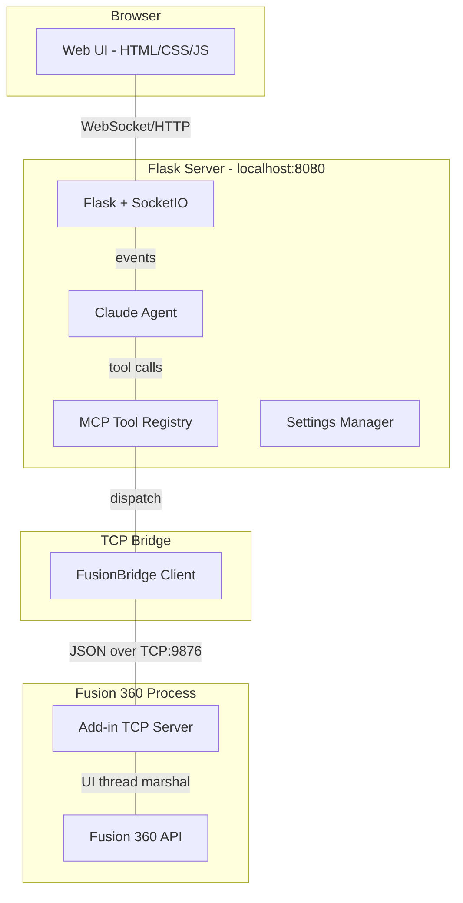
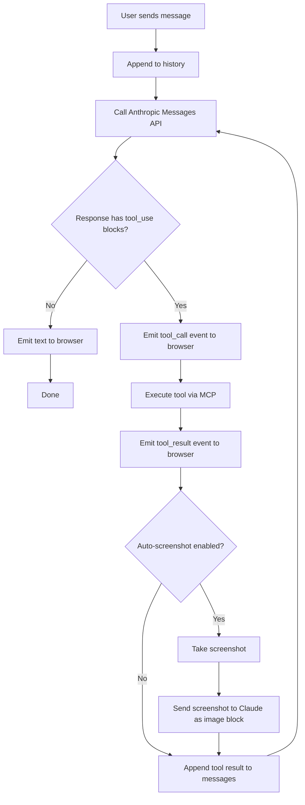
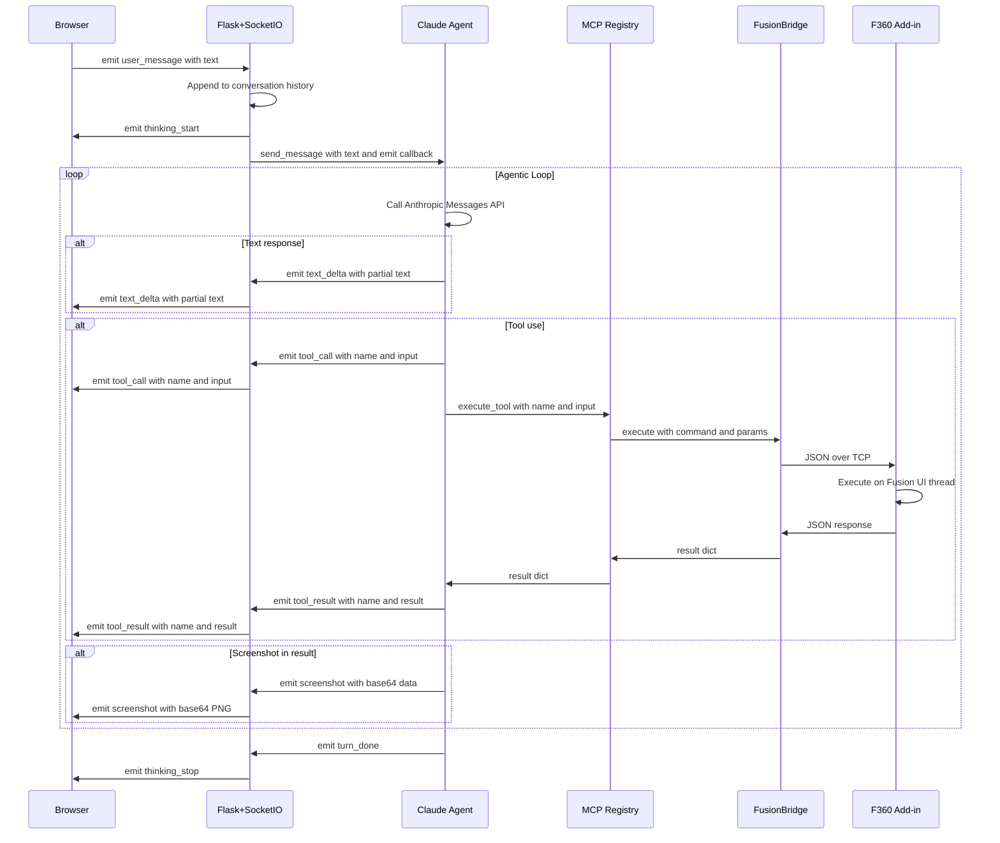
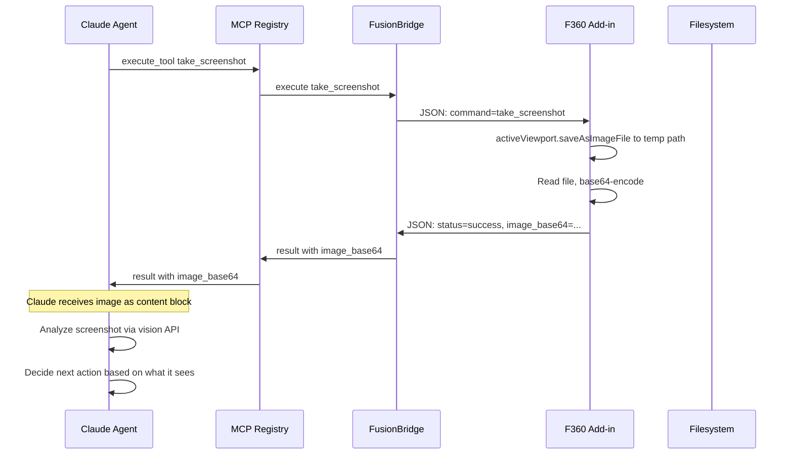
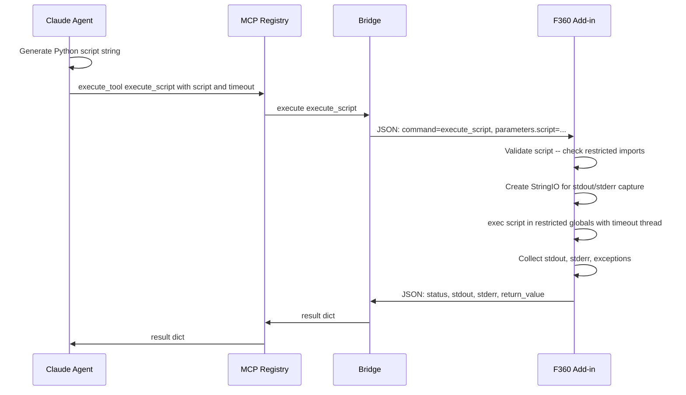
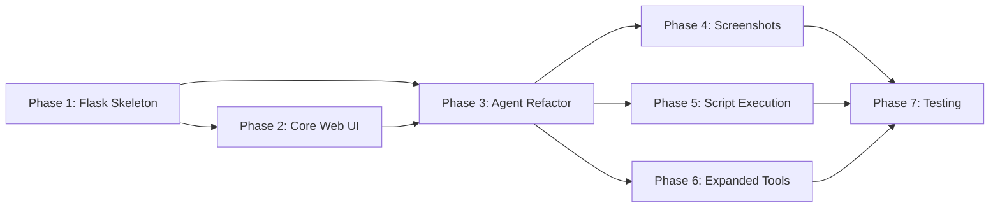

# Fusion 360 MCP -- Architecture Document

> **Version:** 0.3.0 (Web + Agent Refactor)
> **Date:** 2026-04-11
> **Status:** Proposed

---

## Table of Contents

1. [System Overview](#1-system-overview)
2. [Component Descriptions](#2-component-descriptions)
3. [Communication Flow](#3-communication-flow)
4. [WebSocket Event Protocol](#4-websocket-event-protocol)
5. [File Structure](#5-file-structure)
6. [API Endpoint Design](#6-api-endpoint-design)
7. [Tool Schema Overview](#7-tool-schema-overview)
8. [Screenshot Flow](#8-screenshot-flow)
9. [Dynamic Script Execution](#9-dynamic-script-execution)
10. [Migration Plan](#10-migration-plan)

---

## 1. System Overview

The refactored system replaces the Tkinter desktop GUI with a Flask web application served at `http://localhost:8080`. Claude operates as an autonomous agent with full MCP tool access, multimodal vision capabilities via screenshots, and dynamic script generation. The Fusion 360 add-in and TCP bridge remain largely unchanged.

### High-Level Architecture



### Data Flow Summary

```
Browser <--WebSocket/HTTP--> Flask <--Python calls--> Claude Agent
                                                         |
                                                    MCP Registry
                                                         |
                                                    FusionBridge
                                                         |
                                              TCP 127.0.0.1:9876
                                                         |
                                              Fusion 360 Add-in
                                                         |
                                                Fusion 360 API
```

---

## 2. Component Descriptions

### 2.1 Web UI -- Browser Client

| Aspect | Detail |
|--------|--------|
| **Location** | `web/templates/` + `web/static/` |
| **Technology** | HTML5, Tailwind CSS, vanilla JS with Socket.IO client |
| **Responsibility** | Render chat interface, settings panel, status indicators, screenshot display |
| **Communication** | WebSocket via Socket.IO for real-time events; REST for settings and history |

**Key UI regions:**

```
+----------------------------------------------------------+
|  Toolbar: title, connection status pill, action buttons   |
+---------------------------+------------------------------+
|                           |                              |
|   Chat Panel              |   Sidebar                   |
|   - User messages         |   - Settings form            |
|   - AI responses          |   - Tool registry list       |
|   - Tool call blocks      |   - Connection controls      |
|   - Tool result blocks    |                              |
|   - Inline screenshots    |                              |
|   - Thinking indicator    |                              |
|                           |                              |
+---------------------------+------------------------------+
|  Status Bar: activity log, Fusion status, entry count    |
+----------------------------------------------------------+
```

### 2.2 Flask Application -- `web/app.py`

| Aspect | Detail |
|--------|--------|
| **Location** | [`web/app.py`](web/app.py) |
| **Technology** | Flask + Flask-SocketIO with eventlet/gevent async worker |
| **Responsibility** | HTTP routing, WebSocket event handling, session management, static file serving |
| **Key role** | Orchestration hub -- connects browser, Claude agent, MCP registry, and bridge |

The Flask app:
- Serves the single-page web UI at `/`
- Exposes REST endpoints for settings CRUD and conversation history
- Handles WebSocket events for chat messages, connection commands, and status polling
- Instantiates and owns the `ClaudeClient`, `MCPServer`, `FusionBridge`, and `Settings` singletons
- Forwards Claude agent events to the browser in real time via Socket.IO `emit()`

### 2.3 Claude Agent -- `ai/claude_client.py`

| Aspect | Detail |
|--------|--------|
| **Location** | [`ai/claude_client.py`](ai/claude_client.py) |
| **Responsibility** | Agentic tool-use loop, conversation history, multimodal image input |
| **API** | Anthropic Messages API with `tools` parameter |

**Refactored behavior:**
- Replace Tk `after()` thread-safety callbacks with Socket.IO `emit()` calls
- Accept a generic event emitter callback (Socket.IO emit function) instead of Tk-specific one
- Support multimodal content blocks: send screenshots to Claude as `image` content type with `base64` source
- Maintain conversation history with persistence to disk via JSON
- Configurable via a comprehensive "skill document" system prompt loaded from `docs/fusion360_skill.md`

**Agentic loop -- unchanged core logic:**



### 2.4 MCP Tool Registry -- `mcp/server.py`

| Aspect | Detail |
|--------|--------|
| **Location** | [`mcp/server.py`](mcp/server.py) |
| **Responsibility** | Tool schema definitions, input validation, dispatch to bridge, pre/post hooks |
| **Changes** | Add ~17 new tool definitions; add `execute_script` and `take_screenshot` dispatch logic |

The registry remains the single source of truth for tool schemas passed to the Anthropic API. New tools are added as schema definitions in `TOOL_DEFINITIONS` and corresponding dispatch entries in `FusionBridge.execute()`.

### 2.5 Fusion Bridge -- `fusion/bridge.py`

| Aspect | Detail |
|--------|--------|
| **Location** | [`fusion/bridge.py`](fusion/bridge.py) |
| **Responsibility** | TCP client; sends JSON commands to Fusion 360 add-in; simulation fallback |
| **Changes** | Add new command methods for all new tools; add `take_screenshot()` and `execute_script()` methods |

Minimal changes -- the bridge already has a generic `_send_command()` that works for any command string. New methods follow the existing pattern:

```python
def take_screenshot(self) -> dict:
    if self.simulation_mode:
        return self._sim("Screenshot captured -- simulated base64 PNG data")
    return self._send_command("take_screenshot", {})

def execute_script(self, script: str, timeout: int = 30) -> dict:
    if self.simulation_mode:
        return self._sim("Script executed successfully -- simulated output")
    return self._send_command("execute_script", {"script": script, "timeout": timeout})
```

### 2.6 Fusion 360 Add-in -- `fusion_addin/`

| Aspect | Detail |
|--------|--------|
| **Location** | [`fusion_addin/addin_server.py`](fusion_addin/addin_server.py) |
| **Responsibility** | TCP server inside Fusion 360; marshals commands to UI thread; executes Fusion API calls |
| **Changes** | Add handlers for all new commands; add screenshot capture; add script execution sandbox |

**New command handlers added to `_ExecuteEventHandler._execute()`:**

- `take_screenshot` -- uses `adsk.core.Application.activeViewport.saveAsImageFile()` to capture viewport, returns base64-encoded PNG
- `execute_script` -- runs arbitrary Python in a restricted `exec()` with timeout, captures stdout/stderr
- `create_sketch`, `extrude`, `revolve`, `add_fillet`, `add_chamfer`, etc. -- standard Fusion API operations
- `redo` -- executes `Commands.Redo` text command
- `get_timeline` -- reads `design.timeline` features
- `set_parameter` -- modifies user parameters by name
- `create_joint` -- creates joints between components
- `export_stl`, `export_step`, `export_f3d` -- file export via `ExportManager`

### 2.7 Settings Manager -- `config/settings.py`

| Aspect | Detail |
|--------|--------|
| **Location** | [`config/settings.py`](config/settings.py) |
| **Changes** | Remove Tk-specific defaults like `window_width`, `window_height`, `theme`; add `auto_screenshot`, `skill_document_path`, `conversation_history_path` |

**New default keys:**

```python
DEFAULTS = {
    "anthropic_api_key": "",
    "model": "claude-sonnet-4-5-20241022",
    "max_tokens": 4096,
    "system_prompt": "",                          # overridden by skill document
    "skill_document_path": "docs/fusion360_skill.md",
    "fusion_simulation_mode": True,
    "require_confirmation": False,
    "auto_screenshot": True,                      # screenshot after geometry tools
    "allowed_commands": [],
    "max_requests_per_minute": 10,
    "flask_host": "127.0.0.1",
    "flask_port": 8080,
    "conversation_history_path": "data/conversations/",
}
```

---

## 3. Communication Flow

### 3.1 Full Request Lifecycle



### 3.2 Screenshot Flow Detail



### 3.3 TCP Protocol -- Unchanged

Request format over `127.0.0.1:9876`:
```json
{"id": "uuid", "command": "create_cylinder", "parameters": {"radius": 5.0, "height": 10.0}}\n
```

Response format:
```json
{"id": "uuid", "status": "success", "message": "Created cylinder r=5.0 h=10.0"}\n
```

New screenshot response includes `image_base64` field:
```json
{"id": "uuid", "status": "success", "message": "Screenshot captured", "image_base64": "iVBORw0KGgo..."}\n
```

New script execution response includes `stdout`, `stderr`, `return_value`:
```json
{"id": "uuid", "status": "success", "message": "Script executed", "stdout": "...", "stderr": "", "return_value": null}\n
```

---

## 4. WebSocket Event Protocol

All real-time communication between the browser and Flask uses Socket.IO events. Events are namespaced by direction.

### 4.1 Client -> Server Events

| Event Name | Payload | Description |
|------------|---------|-------------|
| `user_message` | `{"text": "Create a 5cm cylinder"}` | User sends a chat message |
| `connect_fusion` | `{}` | Request Fusion 360 bridge reconnection |
| `disconnect_fusion` | `{}` | Disconnect from Fusion 360 bridge |
| `clear_history` | `{}` | Clear conversation history |
| `update_settings` | `{"anthropic_api_key": "...", "model": "...", ...}` | Update settings |
| `get_status` | `{}` | Request current connection and system status |
| `cancel_turn` | `{}` | Cancel current Claude turn -- best effort |

### 4.2 Server -> Client Events

| Event Name | Payload | Description |
|------------|---------|-------------|
| `text_delta` | `{"text": "Here is the partial response..."}` | Streaming text fragment from Claude |
| `text_done` | `{"text": "Full assembled text block"}` | Complete text block finished |
| `tool_call` | `{"tool_name": "create_cylinder", "tool_input": {"radius": 5}, "tool_use_id": "toolu_xxx"}` | Claude is calling a tool |
| `tool_result` | `{"tool_name": "create_cylinder", "tool_use_id": "toolu_xxx", "result": {"status": "success", "message": "..."}}` | Tool execution result |
| `screenshot` | `{"image_base64": "iVBORw0KGgo...", "tool_use_id": "toolu_xxx"}` | Screenshot image data for inline display |
| `thinking_start` | `{}` | Claude has begun processing |
| `thinking_stop` | `{}` | Claude has finished processing |
| `error` | `{"message": "Invalid API key"}` | Error occurred |
| `status_update` | `{"fusion_connected": true, "simulation_mode": false, "model": "...", "tool_count": 24}` | System status broadcast |
| `settings_saved` | `{"success": true}` | Settings persistence confirmed |
| `log_entry` | `{"level": "info", "icon": "info-circle", "message": "..."}` | Activity log entry |

### 4.3 Payload Conventions

- All payloads are JSON objects
- Timestamps are ISO 8601 UTC strings when present
- `image_base64` fields contain raw base64 without data URI prefix; the client prepends `data:image/png;base64,`
- Error payloads always include a `message` string field

---

## 5. File Structure

```
Fusion_360_MCP/
|-- main.py                          # Entry point -- starts Flask server
|-- requirements.txt                 # Updated dependencies
|
|-- ai/
|   |-- __init__.py
|   |-- claude_client.py             # Refactored: emits via callback, supports images
|
|-- config/
|   |-- __init__.py
|   |-- settings.py                  # Updated defaults for web mode
|   |-- config.json                  # Persisted settings -- gitignored
|
|-- fusion/
|   |-- __init__.py
|   |-- bridge.py                    # Extended: new command methods
|
|-- fusion_addin/
|   |-- __init__.py
|   |-- addin_server.py              # Extended: new command handlers
|   |-- Fusion360MCP.py              # Add-in entry point -- unchanged
|   |-- Fusion360MCP.manifest        # Add-in manifest -- unchanged
|
|-- mcp/
|   |-- __init__.py
|   |-- server.py                    # Extended: new tool schemas
|
|-- web/                             # NEW -- replaces ui/
|   |-- __init__.py
|   |-- app.py                       # Flask app factory + SocketIO setup
|   |-- routes.py                    # REST API route handlers
|   |-- events.py                    # SocketIO event handlers
|   |-- templates/
|   |   |-- index.html               # Single-page app shell
|   |-- static/
|       |-- css/
|       |   |-- app.css              # Custom styles -- Tailwind via CDN
|       |-- js/
|       |   |-- app.js               # Main client logic + Socket.IO
|       |   |-- chat.js              # Chat rendering module
|       |   |-- settings.js          # Settings panel module
|       |   |-- status.js            # Status bar module
|       |-- img/
|           |-- logo.svg             # App logo
|
|-- docs/
|   |-- ARCHITECTURE.md              # This document
|   |-- fusion360_skill.md           # Comprehensive F360 skill document for Claude
|
|-- data/                            # Runtime data -- gitignored
|   |-- conversations/               # Saved conversation histories
|   |-- screenshots/                 # Cached screenshot files
|
|-- tests/
|   |-- __init__.py
|   |-- test_fusion_bridge.py        # Existing tests
|   |-- test_mcp_server.py           # Existing tests
|   |-- test_web_app.py              # NEW: Flask route + event tests
|   |-- test_claude_client.py        # NEW: Agent loop tests
|
|-- ui/                              # DEPRECATED -- removed after migration
|   |-- ...
```

### Key Changes from Current Structure

| Current | New | Reason |
|---------|-----|--------|
| `ui/app.py` | `web/app.py` | Flask replaces Tkinter |
| `ui/chat_panel.py` | `web/static/js/chat.js` + `web/templates/index.html` | Browser-rendered |
| `ui/settings_panel.py` | `web/static/js/settings.js` + REST endpoints | Browser-rendered |
| `ui/status_panel.py` | `web/static/js/status.js` | Browser-rendered |
| `main.py` starts Tk loop | `main.py` starts Flask server | `app.run()` replaces `app.mainloop()` |

---

## 6. API Endpoint Design

### 6.1 REST Endpoints

| Method | Path | Description | Request Body | Response |
|--------|------|-------------|--------------|----------|
| `GET` | `/` | Serve the main SPA HTML | -- | `index.html` |
| `GET` | `/api/settings` | Get current settings -- API key masked | -- | `{"model": "...", "api_key_set": true, ...}` |
| `POST` | `/api/settings` | Update settings | `{"model": "...", ...}` | `{"success": true}` |
| `GET` | `/api/tools` | List all registered MCP tools | -- | `{"tools": [{...schema...}]}` |
| `GET` | `/api/status` | Get system status | -- | `{"fusion_connected": true, ...}` |
| `GET` | `/api/conversations` | List saved conversations | -- | `{"conversations": [{"id": "...", "date": "..."}]}` |
| `GET` | `/api/conversations/<id>` | Load a specific conversation | -- | `{"messages": [...]}` |
| `DELETE` | `/api/conversations/<id>` | Delete a conversation | -- | `{"success": true}` |
| `POST` | `/api/conversations` | Save current conversation | `{"name": "..."}` | `{"id": "...", "success": true}` |
| `GET` | `/api/screenshot/<filename>` | Serve a cached screenshot file | -- | PNG image |

### 6.2 WebSocket Endpoint

| Path | Description |
|------|-------------|
| `/socket.io/` | Socket.IO transport -- auto-negotiated by Flask-SocketIO |

The Socket.IO connection is established on page load and maintained for the browser session lifetime. Events are defined in [Section 4](#4-websocket-event-protocol).

### 6.3 Flask App Factory

```python
# web/app.py -- pseudocode structure
from flask import Flask
from flask_socketio import SocketIO

socketio = SocketIO()

def create_app() -> Flask:
    app = Flask(__name__,
                template_folder="templates",
                static_folder="static")

    # Load config
    from config.settings import settings
    app.config["SECRET_KEY"] = os.urandom(24).hex()

    # Initialize components
    from fusion.bridge import FusionBridge
    from mcp.server import MCPServer
    from ai.claude_client import ClaudeClient

    bridge = FusionBridge(simulation_mode=settings.simulation_mode)
    mcp = MCPServer(bridge)
    claude = ClaudeClient(settings, mcp)

    # Store on app for access in routes/events
    app.bridge = bridge
    app.mcp = mcp
    app.claude = claude
    app.settings = settings

    # Register blueprints and events
    from web.routes import api_bp
    app.register_blueprint(api_bp, url_prefix="/api")

    from web import events
    events.register(socketio, app)

    socketio.init_app(app, cors_allowed_origins="*", async_mode="eventlet")
    return app
```

---

## 7. Tool Schema Overview

### 7.1 Existing Tools -- Retained

| Tool | Category | Parameters |
|------|----------|------------|
| `get_document_info` | Document | -- |
| `create_cylinder` | Geometry | `radius`: number, `height`: number, `position?`: number[3] |
| `create_box` | Geometry | `length`: number, `width`: number, `height`: number, `position?`: number[3] |
| `create_sphere` | Geometry | `radius`: number, `position?`: number[3] |
| `get_body_list` | Document | -- |
| `undo` | Edit | -- |
| `save_document` | Document | -- |

### 7.2 New Tools -- Sketching

| Tool | Description | Parameters |
|------|-------------|------------|
| `create_sketch` | Create a new sketch on a plane | `plane`: string enum: `XY`, `XZ`, `YZ`, or body face index; `offset?`: number |
| `add_sketch_line` | Add a line to the active sketch | `sketch_name`: string, `start`: number[2], `end`: number[2] |
| `add_sketch_circle` | Add a circle to the active sketch | `sketch_name`: string, `center`: number[2], `radius`: number |
| `add_sketch_arc` | Add an arc to the active sketch | `sketch_name`: string, `center`: number[2], `start_angle`: number, `end_angle`: number, `radius`: number |
| `add_sketch_rectangle` | Add a rectangle to the active sketch | `sketch_name`: string, `corner1`: number[2], `corner2`: number[2] |

### 7.3 New Tools -- Feature Operations

| Tool | Description | Parameters |
|------|-------------|------------|
| `extrude` | Extrude a sketch profile | `sketch_name`: string, `profile_index`: integer, `distance`: number, `operation?`: string enum: `new_body`, `join`, `cut`, `intersect` |
| `revolve` | Revolve a sketch profile | `sketch_name`: string, `profile_index`: integer, `axis`: string, `angle`: number |
| `add_fillet` | Fillet edges | `body_name`: string, `edge_indices`: integer[], `radius`: number |
| `add_chamfer` | Chamfer edges | `body_name`: string, `edge_indices`: integer[], `distance`: number |

### 7.4 New Tools -- Body Operations

| Tool | Description | Parameters |
|------|-------------|------------|
| `mirror_body` | Mirror a body across a plane | `body_name`: string, `mirror_plane`: string enum: `XY`, `XZ`, `YZ` |
| `pattern_body` | Circular or rectangular pattern | `body_name`: string, `pattern_type`: string enum: `rectangular`, `circular`, `axis`: string, `count`: integer, `spacing`: number |
| `select_body` | Select a body by name | `body_name`: string |
| `apply_material` | Apply material to a body | `body_name`: string, `material_name`: string |
| `create_component` | Create a new component | `name`: string, `parent?`: string |
| `create_joint` | Create a joint between components | `component1`: string, `component2`: string, `joint_type`: string enum: `rigid`, `revolute`, `slider`, `cylindrical`, `pin_slot`, `planar`, `ball` |

### 7.5 New Tools -- Export and Utility

| Tool | Description | Parameters |
|------|-------------|------------|
| `export_stl` | Export body as STL | `body_name?`: string, `filename`: string, `refinement?`: string enum: `low`, `medium`, `high` |
| `export_step` | Export as STEP | `filename`: string |
| `export_f3d` | Export as F3D archive | `filename`: string |
| `redo` | Redo last undone operation | -- |
| `get_timeline` | Get design timeline entries | -- |
| `set_parameter` | Set a named user parameter | `name`: string, `value`: number, `unit?`: string |

### 7.6 New Tools -- Vision and Scripting

| Tool | Description | Parameters |
|------|-------------|------------|
| `take_screenshot` | Capture current viewport as PNG | `width?`: integer default 1920, `height?`: integer default 1080 |
| `execute_script` | Execute arbitrary Python in Fusion 360 | `script`: string, `timeout?`: integer default 30 |

### 7.7 Tool Result Schema Convention

All tool results follow this standard shape:

```json
{
    "status": "success | error | simulation",
    "message": "Human-readable description of what happened",

    // Optional fields depending on tool:
    "image_base64": "...",          // take_screenshot
    "stdout": "...",                // execute_script
    "stderr": "...",                // execute_script
    "return_value": null,           // execute_script
    "bodies": [],                   // get_body_list
    "timeline_entries": [],         // get_timeline
    "file_path": "..."             // export_* tools
}
```

---

## 8. Screenshot Flow

### 8.1 Capture Mechanism

Inside the Fusion 360 add-in, the `take_screenshot` handler:

1. Creates a temporary file path: `os.path.join(tempfile.gettempdir(), f"f360_mcp_{uuid4()}.png")`
2. Calls `app.activeViewport.saveAsImageFile(temp_path, width, height)`
3. Reads the file and base64-encodes the contents
4. Deletes the temporary file
5. Returns `{"status": "success", "image_base64": "<base64>", "message": "Screenshot captured"}`

### 8.2 Integration with Claude Agent

When Claude receives a `take_screenshot` tool result, the agent builds a multimodal content block:

```python
tool_results.append({
    "type": "tool_result",
    "tool_use_id": tc.id,
    "content": [
        {"type": "text", "text": result.get("message", "Screenshot captured")},
        {
            "type": "image",
            "source": {
                "type": "base64",
                "media_type": "image/png",
                "data": result["image_base64"],
            },
        },
    ],
})
```

This allows Claude to "see" the Fusion 360 viewport and reason about the visual state of the design.

### 8.3 Auto-Screenshot Feature

When `settings.auto_screenshot` is `True`, the agent automatically calls `take_screenshot` after any geometry-modifying tool:

- `create_cylinder`, `create_box`, `create_sphere`
- `extrude`, `revolve`
- `add_fillet`, `add_chamfer`
- `mirror_body`, `pattern_body`
- `execute_script` -- if it modified geometry

The auto-screenshot result is appended as an additional image block in the tool result sent back to Claude.

### 8.4 Browser Display

The browser client receives `screenshot` events and renders them inline in the chat:

```javascript
socket.on("screenshot", (data) => {
    const img = document.createElement("img");
    img.src = "data:image/png;base64," + data.image_base64;
    img.className = "screenshot-inline";
    chatContainer.appendChild(img);
});
```

---

## 9. Dynamic Script Execution

### 9.1 Purpose

The `execute_script` tool allows Claude to write and execute arbitrary Fusion 360 Python scripts on-the-fly. This covers operations not available as predefined MCP tools, such as complex parametric geometry, custom patterns, or API calls to niche Fusion 360 features.

### 9.2 Execution Flow



### 9.3 Safety Measures

| Measure | Implementation |
|---------|---------------|
| **Timeout** | Script execution runs in a daemon thread with a configurable timeout -- default 30 seconds. If exceeded, the thread is abandoned and an error returned. |
| **Import restrictions** | A restricted `__builtins__` dict is provided. Blocked modules: `os`, `sys`, `subprocess`, `shutil`, `socket`, `http`, `urllib`, `importlib`, `ctypes`, `signal`. Allowed: `math`, `json`, `re`, `collections`, `itertools`, `functools`. |
| **Output capture** | `sys.stdout` and `sys.stderr` are redirected to `StringIO` objects during execution. Output is truncated to 10KB to prevent memory issues. |
| **Scope isolation** | Scripts execute in a fresh `globals()` dict pre-populated with Fusion 360 objects: `app`, `ui`, `design`, `rootComp`, `adsk`. No access to the add-in server internals. |
| **No file I/O** | `open`, `exec`, `eval`, `compile` are removed from builtins. Claude can only interact with Fusion via the `adsk` API objects provided. |
| **Error containment** | All exceptions are caught, formatted, and returned as `stderr`. The add-in process is never crashed. |

### 9.4 Script Globals Available to Claude

```python
script_globals = {
    "adsk": adsk,
    "app": adsk.core.Application.get(),
    "ui": app.userInterface,
    "design": app.activeProduct,
    "rootComp": design.rootComponent,
    "Point3D": adsk.core.Point3D,
    "Vector3D": adsk.core.Vector3D,
    "Matrix3D": adsk.core.Matrix3D,
    "ValueInput": adsk.core.ValueInput,
    "FeatureOperations": adsk.fusion.FeatureOperations,
    "math": math,
    "json": json,
    "print": captured_print,          # output goes to stdout capture
}
```

### 9.5 Example Script Claude Might Generate

```python
# Create a parametric gear profile
import math

sketches = rootComp.sketches
sketch = sketches.add(rootComp.xYConstructionPlane)

num_teeth = 20
module_val = 2.0  # mm
pitch_radius = num_teeth * module_val / 2

# Draw involute tooth profile...
for i in range(num_teeth):
    angle = 2 * math.pi * i / num_teeth
    # ... sketch geometry code
```

---

## 10. Migration Plan

### Phase 1: Foundation -- Flask Skeleton

- [ ] Create `web/` directory structure: `app.py`, `routes.py`, `events.py`, `templates/`, `static/`
- [ ] Implement Flask app factory in `web/app.py` with Socket.IO initialization
- [ ] Create `web/templates/index.html` with basic HTML shell and Tailwind CSS CDN
- [ ] Create `web/static/js/app.js` with Socket.IO client connection
- [ ] Update `requirements.txt`: add `flask`, `flask-socketio`, `eventlet`; remove `tkinter-tooltip`
- [ ] Refactor `main.py` to start Flask instead of Tkinter

### Phase 2: Core Web UI

- [ ] Implement chat panel in `web/static/js/chat.js` -- message rendering, input box, send button
- [ ] Implement settings panel in `web/static/js/settings.js` -- form fields, save/revert
- [ ] Implement status bar in `web/static/js/status.js` -- log entries, connection indicator
- [ ] Implement REST routes in `web/routes.py` -- settings CRUD, tool list, status
- [ ] Implement Socket.IO events in `web/events.py` -- wire up all events from Section 4
- [ ] Style the UI with Tailwind CSS to match the existing dark theme color palette

### Phase 3: Claude Agent Refactor

- [ ] Refactor `ai/claude_client.py` -- replace Tk callbacks with generic event emitter
- [ ] Add multimodal image support to the agentic loop
- [ ] Add conversation history persistence -- save/load JSON to `data/conversations/`
- [ ] Create `docs/fusion360_skill.md` -- comprehensive Fusion 360 skill document for system prompt
- [ ] Wire Claude agent events to Socket.IO emissions in `web/events.py`

### Phase 4: Screenshot Capability

- [ ] Add `take_screenshot` handler to `fusion_addin/addin_server.py`
- [ ] Add `take_screenshot()` method to `fusion/bridge.py`
- [ ] Add `take_screenshot` tool schema to `mcp/server.py`
- [ ] Add screenshot display to browser chat UI -- inline `` rendering
- [ ] Add auto-screenshot logic to Claude agent after geometry-modifying tools
- [ ] Add screenshot simulation mode to bridge

### Phase 5: Dynamic Script Execution

- [ ] Add `execute_script` handler to `fusion_addin/addin_server.py` with safety sandbox
- [ ] Add `execute_script()` method to `fusion/bridge.py`
- [ ] Add `execute_script` tool schema to `mcp/server.py`
- [ ] Add script result display in browser -- stdout/stderr collapsible blocks
- [ ] Add script execution simulation mode to bridge

### Phase 6: Expanded MCP Tools

- [ ] Add all new tool schemas to `mcp/server.py` -- sketching, features, body ops, export, utility
- [ ] Add corresponding bridge methods to `fusion/bridge.py` with simulation fallbacks
- [ ] Add command handlers to `fusion_addin/addin_server.py` for each new tool
- [ ] Update `TOOL_CATEGORIES` dict for UI grouping
- [ ] Add bridge dispatch entries for all new commands

### Phase 7: Testing and Cleanup

- [ ] Write Flask route tests in `tests/test_web_app.py`
- [ ] Write Socket.IO event tests
- [ ] Write Claude agent tests in `tests/test_claude_client.py`
- [ ] Test end-to-end flow in simulation mode
- [ ] Remove `ui/` directory
- [ ] Update `FEATURES.md` with v0.3.0 status
- [ ] Update `README.md` with new setup instructions

### Dependencies Between Phases



### Updated `requirements.txt`

```
anthropic>=0.25.0
flask>=3.0.0
flask-socketio>=5.3.0
eventlet>=0.36.0
Pillow>=10.0.0
requests>=2.31.0
python-dotenv>=1.0.0
```

---

## Appendix A: Color Palette

Retained from the existing Tkinter theme for visual consistency:

| Name | Hex | Usage |
|------|-----|-------|
| bg | `#1e1e2e` | Page background |
| surface | `#2a2a3e` | Card/panel backgrounds |
| surface2 | `#313145` | Elevated elements |
| border | `#3b3b5c` | Dividers and borders |
| accent | `#7aa2f7` | Primary actions, links |
| accent2 | `#bb9af7` | Secondary accent, AI labels |
| success | `#9ece6a` | Success states |
| warning | `#e0af68` | Warnings, simulation mode |
| error | `#f7768e` | Errors |
| text | `#c0caf5` | Primary text |
| text_dim | `#565f89` | Muted/secondary text |

---

## Appendix B: Skill Document Outline

The file `docs/fusion360_skill.md` will be loaded as Claude's system prompt. Outline:

1. **Identity** -- You are a Fusion 360 CAD engineer assistant
2. **Available tools** -- Complete reference of all MCP tools with parameter details
3. **Fusion 360 concepts** -- Sketches, profiles, features, timeline, components, joints, parameters
4. **Units** -- All dimensions in centimeters (Fusion 360 internal unit)
5. **Workflow patterns** -- Sketch-then-extrude, revolve, fillet, export
6. **Screenshot usage** -- When and how to request screenshots; how to interpret them
7. **Script generation** -- When to use `execute_script` vs predefined tools; available globals; safety rules
8. **Error handling** -- How to recover from failed operations; undo strategy
9. **Best practices** -- Naming conventions, component organization, parametric design

---

## Appendix C: Glossary

| Term | Definition |
|------|------------|
| **MCP** | Model Context Protocol -- the tool-use interface between Claude and external systems |
| **Bridge** | The TCP client (`fusion/bridge.py`) connecting the Flask server to the Fusion 360 add-in |
| **Add-in** | The Fusion 360 plugin (`fusion_addin/`) running inside Fusion's Python environment |
| **Agentic loop** | Claude's autonomous cycle of reasoning, calling tools, observing results, and deciding next steps |
| **Skill document** | A comprehensive system prompt teaching Claude about Fusion 360 capabilities |
| **UI thread marshal** | The pattern of queuing work from TCP threads onto Fusion's main UI thread via custom events |
