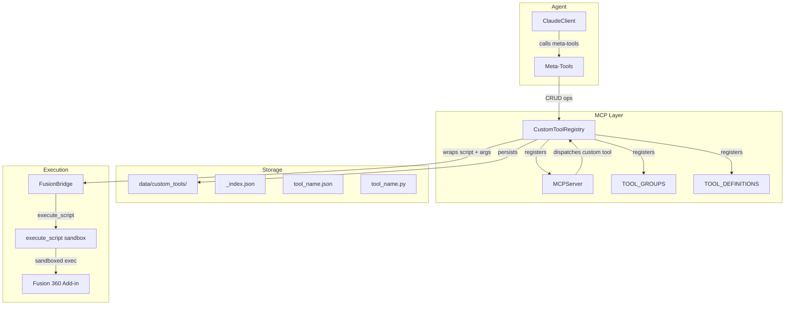
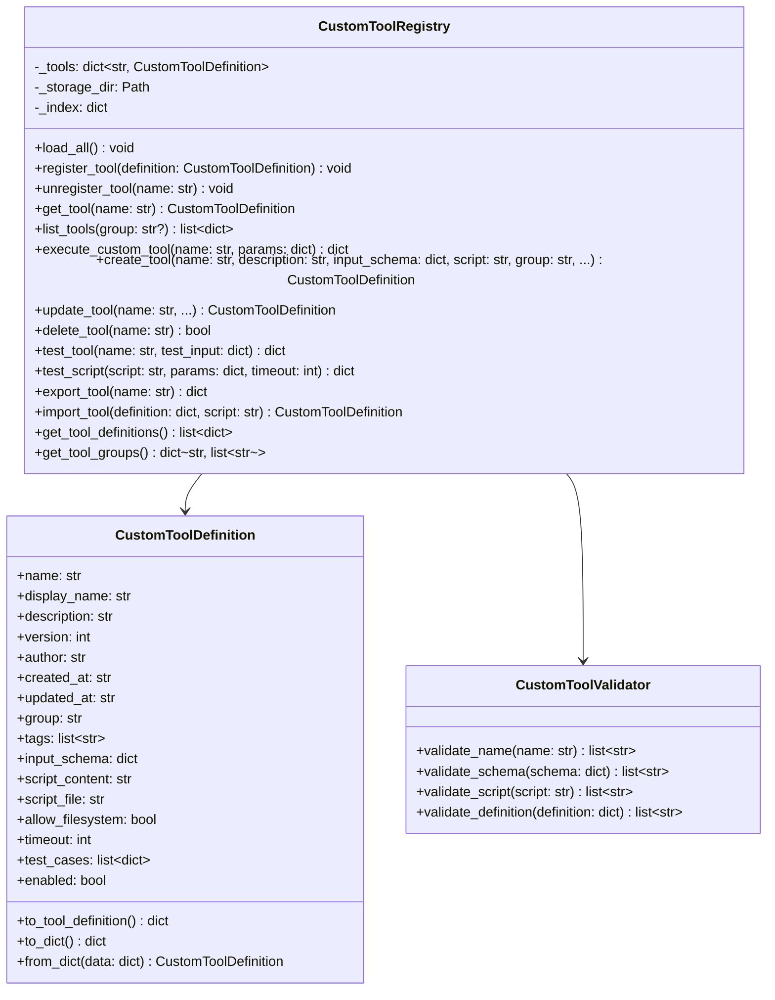
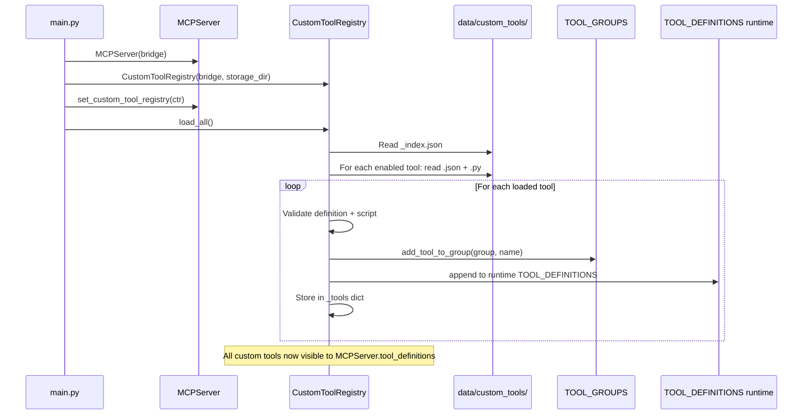
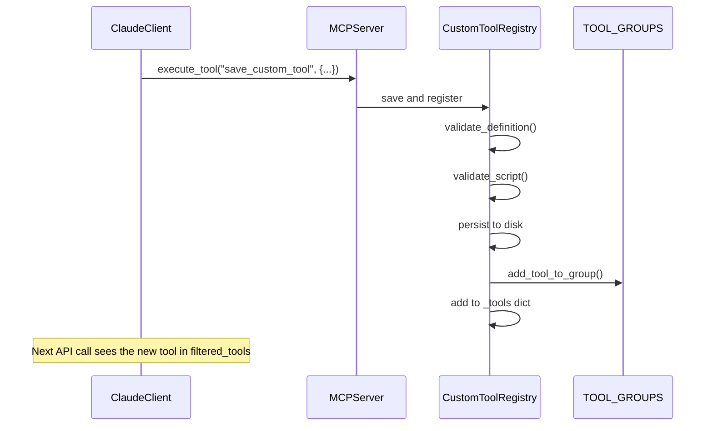
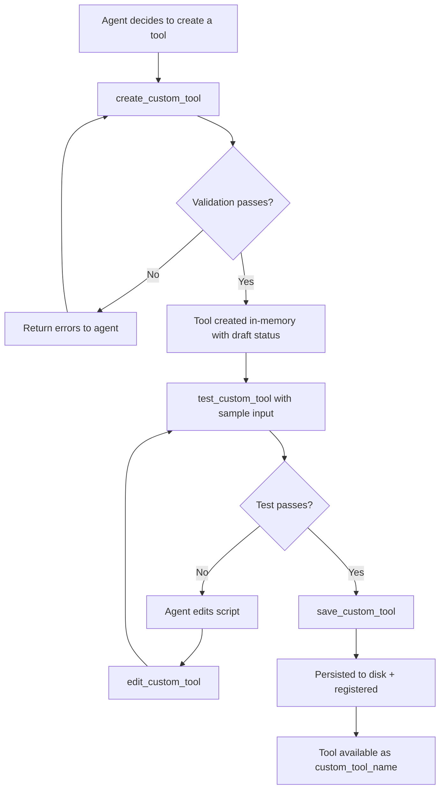
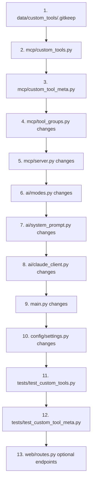
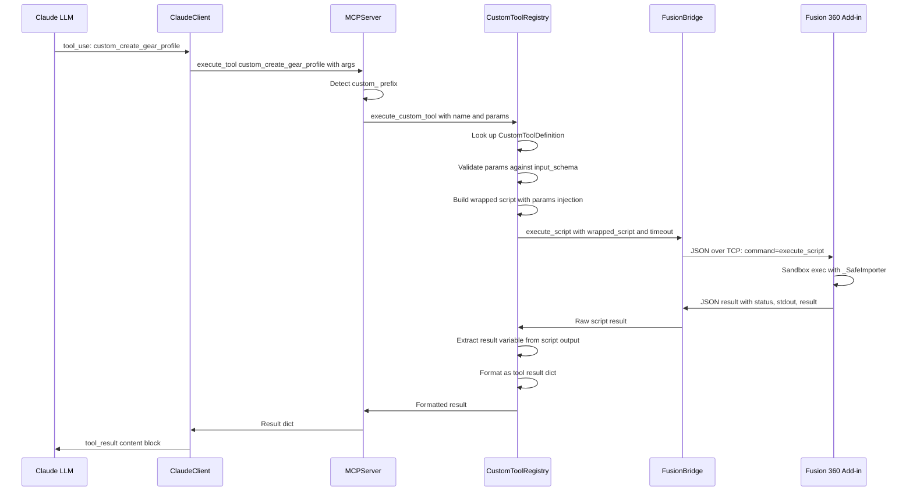
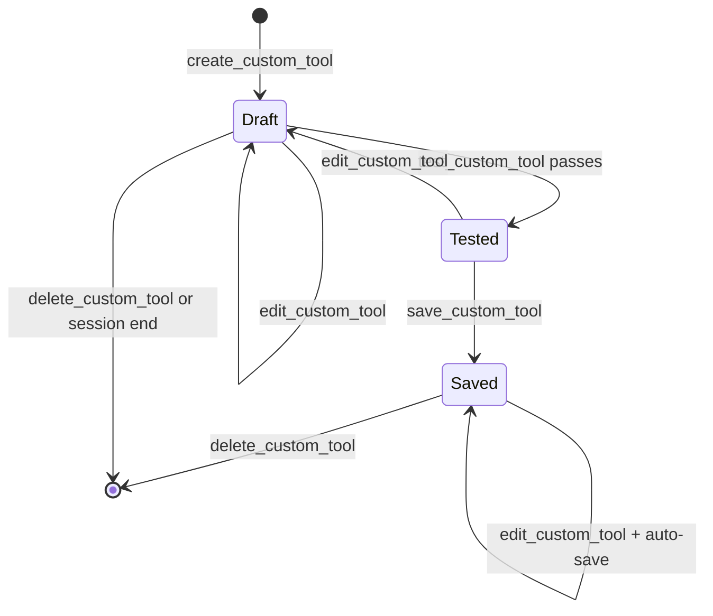

# Custom Tools System -- Architecture Document

> **Version:** 1.0.0
> **Date:** 2026-04-20
> **Status:** Proposed
> **Depends on:** ARCHITECTURE.md v0.3.0

---

## Table of Contents

1. [Overview](#1-overview)
2. [Data Model](#2-data-model)
3. [Core Components](#3-core-components)
4. [Registration Flow](#4-registration-flow)
5. [Creation Workflow](#5-creation-workflow)
6. [Testing Workflow](#6-testing-workflow)
7. [Security Considerations](#7-security-considerations)
8. [API Surface -- Meta-Tools](#8-api-surface----meta-tools)
9. [Integration Points](#9-integration-points)
10. [File-by-File Implementation Plan](#10-file-by-file-implementation-plan)

---

## 1. Overview

This document specifies a system that allows the Artifex360 AI agent to **dynamically create, test, save, and reuse custom tools** at runtime. Custom tools are Python scripts that execute inside Fusion 360 via the existing [`execute_script`](../mcp/server.py:173) sandbox. They are persisted to disk as JSON definition files alongside their implementation scripts, and are registered with the MCP server so they appear in the agent's tool list identically to built-in tools.

### Design Principles

- **Reuse existing infrastructure**: Custom tool scripts execute through [`FusionBridge.execute_script()`](../fusion/bridge.py:365), which routes to the [`_SafeImporter`](../fusion_addin/addin_server.py:116) sandbox in the add-in. No new execution path is introduced.
- **Schema compatibility**: Custom tool definitions use the exact same `{name, description, input_schema}` format as [`TOOL_DEFINITIONS`](../mcp/server.py:52).
- **Separation of concerns**: A new `mcp/custom_tools.py` module owns all CRUD and registry logic. The existing [`MCPServer`](../mcp/server.py:925) and [`ModeManager`](../ai/modes.py:223) are extended minimally.
- **Security by default**: All custom scripts pass through the same sandbox as `execute_script`. An additional static validation layer rejects obviously dangerous patterns before the script ever reaches Fusion 360.

### High-Level Architecture



---

## 2. Data Model

### 2.1 Custom Tool Definition Schema

Each custom tool is stored as a JSON file conforming to this schema. The schema mirrors the existing [`TOOL_DEFINITIONS`](../mcp/server.py:52) format with additional metadata fields.

```json
{
  "name": "create_gear_profile",
  "description": "Create an involute spur gear profile sketch with configurable module, tooth count, and pressure angle.",
  "version": 1,
  "author": "agent",
  "created_at": "2026-04-20T00:00:00Z",
  "updated_at": "2026-04-20T00:00:00Z",
  "group": "custom_geometry",
  "tags": ["gear", "sketch", "parametric"],
  "input_schema": {
    "type": "object",
    "properties": {
      "module_val": {
        "type": "number",
        "description": "Gear module in centimeters."
      },
      "num_teeth": {
        "type": "integer",
        "description": "Number of teeth on the gear."
      },
      "pressure_angle": {
        "type": "number",
        "description": "Pressure angle in degrees (default 20).",
        "default": 20
      },
      "plane": {
        "type": "string",
        "enum": ["XY", "XZ", "YZ"],
        "description": "Construction plane for the sketch.",
        "default": "XY"
      }
    },
    "required": ["module_val", "num_teeth"]
  },
  "script_file": "create_gear_profile.py",
  "allow_filesystem": false,
  "timeout": 30,
  "test_cases": [
    {
      "name": "basic_gear",
      "description": "Create a 20-tooth gear with module 0.5",
      "input": {"module_val": 0.5, "num_teeth": 20},
      "expect_success": true
    }
  ]
}
```

#### Field Reference

| Field | Type | Required | Description |
|-------|------|----------|-------------|
| `name` | string | yes | Unique tool name. Must match `^[a-z][a-z0-9_]{2,63}$`. Prefixed with `custom_` at registration to avoid collisions with built-in tools. |
| `description` | string | yes | Human-readable description shown to the LLM. |
| `version` | integer | yes | Monotonically increasing version number. Incremented on each edit. |
| `author` | string | yes | Always `"agent"` for AI-created tools. |
| `created_at` | string | yes | ISO 8601 UTC timestamp. |
| `updated_at` | string | yes | ISO 8601 UTC timestamp. |
| `group` | string | yes | Custom tool group name. Used in [`TOOL_GROUPS`](../mcp/tool_groups.py:11). |
| `tags` | string[] | no | Free-form tags for organization and search. |
| `input_schema` | object | yes | JSON Schema for tool parameters. Must be `{"type": "object", ...}` with `properties` and `required`. |
| `script_file` | string | yes | Filename of the Python script relative to the tool's directory. |
| `allow_filesystem` | boolean | no | Whether to grant filesystem access via `execute_script`'s `allow_filesystem` parameter. Default `false`. |
| `timeout` | integer | no | Execution timeout in seconds. Default 30. Max 120. |
| `test_cases` | array | no | Predefined test inputs for validation. |

### 2.2 Script File Format

The Python script receives tool parameters as a pre-injected `params` dict variable. It also has access to all the standard [`execute_script` globals](../fusion_addin/addin_server.py:80): `adsk`, `app`, `design`, `rootComp`, `ui`, `Point3D`, `Vector3D`, `Matrix3D`, `ObjectCollection`, `ValueInput`, `FeatureOperations`, `math`, `json`, etc.

The script must set a `result` variable to return data to the caller.

```python
# create_gear_profile.py
# params: {"module_val": 0.5, "num_teeth": 20, "pressure_angle": 20, "plane": "XY"}

module_val = params["module_val"]
num_teeth = params["num_teeth"]
pressure_angle = params.get("pressure_angle", 20)
plane_name = params.get("plane", "XY")

# Select construction plane
planes = {
    "XY": rootComp.xYConstructionPlane,
    "XZ": rootComp.xZConstructionPlane,
    "YZ": rootComp.yZConstructionPlane,
}
plane = planes[plane_name]

# Create sketch
sketch = rootComp.sketches.add(plane)
sketch.name = f"GearProfile_{num_teeth}T_M{module_val}"

# Calculate gear geometry
pitch_radius = num_teeth * module_val / 2
# ... gear involute math ...

result = {
    "success": True,
    "message": f"Created gear profile: {num_teeth} teeth, module {module_val}",
    "sketch_name": sketch.name,
    "pitch_radius": pitch_radius,
}
```

### 2.3 Directory Structure

```
data/custom_tools/
  _index.json                          # Master index of all custom tools
  custom_geometry/                     # Tool group directory
    create_gear_profile.json           # Tool definition
    create_gear_profile.py             # Tool script
    create_honeycomb_pattern.json
    create_honeycomb_pattern.py
  custom_fasteners/                    # Another tool group
    create_hex_bolt.json
    create_hex_bolt.py
    create_threaded_hole.json
    create_threaded_hole.py
```

### 2.4 Master Index

The `_index.json` file provides fast lookup without scanning subdirectories. It is rebuilt from the filesystem on startup and kept in sync by CRUD operations.

```json
{
  "version": 1,
  "tools": {
    "custom_create_gear_profile": {
      "group": "custom_geometry",
      "definition_file": "custom_geometry/create_gear_profile.json",
      "script_file": "custom_geometry/create_gear_profile.py",
      "version": 1,
      "enabled": true
    },
    "custom_create_hex_bolt": {
      "group": "custom_fasteners",
      "definition_file": "custom_fasteners/create_hex_bolt.json",
      "script_file": "custom_fasteners/create_hex_bolt.py",
      "version": 2,
      "enabled": true
    }
  },
  "groups": ["custom_geometry", "custom_fasteners"]
}
```

---

## 3. Core Components

### 3.1 New Module: `mcp/custom_tools.py`

This is the primary new module. It owns:

- **`CustomToolRegistry`** -- The central class managing the lifecycle of custom tools.
- **`CustomToolDefinition`** -- Data class representing a loaded custom tool.
- **`CustomToolValidator`** -- Validates tool definitions and scripts before saving.



#### `CustomToolRegistry` Responsibilities

| Method | Description |
|--------|-------------|
| `load_all()` | Scan `data/custom_tools/`, load all definitions and scripts, register enabled tools with the MCP server. Called at startup. |
| `register_tool()` | Add a custom tool's definition to the MCP server's runtime `TOOL_DEFINITIONS` list, `TOOL_GROUPS`, and `TOOL_CATEGORIES`. Wire up dispatch. |
| `unregister_tool()` | Remove a custom tool from all runtime registries. |
| `execute_custom_tool()` | Build a wrapper script that injects `params` and executes the tool's script via [`FusionBridge.execute_script()`](../fusion/bridge.py:365). |
| `create_tool()` | Validate, persist to disk, register at runtime. |
| `update_tool()` | Validate changes, increment version, persist, re-register. |
| `delete_tool()` | Unregister, remove files from disk, update index. |
| `test_tool()` | Execute a saved tool with test input. Does NOT save or register. |
| `test_script()` | Execute a raw script string with test params. For pre-save testing. |

### 3.2 Changes to Existing Modules

#### `mcp/server.py` -- [`MCPServer`](../mcp/server.py:925)

Add a reference to `CustomToolRegistry` and extend dispatch to handle custom tools.

```python
class MCPServer:
    _CUSTOM_TOOL_PREFIX = "custom_"

    def __init__(self, fusion_bridge):
        self.bridge = fusion_bridge
        self._custom_tools: CustomToolRegistry | None = None  # NEW
        # ... existing init ...

    def set_custom_tool_registry(self, registry: CustomToolRegistry) -> None:
        """Attach the custom tools registry."""
        self._custom_tools = registry

    @property
    def tool_definitions(self) -> list[dict[str, Any]]:
        """Return built-in + custom tool definitions."""
        defs = list(TOOL_DEFINITIONS)
        if self._custom_tools:
            defs.extend(self._custom_tools.get_tool_definitions())
        return defs

    def execute_tool(self, tool_name: str, tool_input: dict) -> dict:
        # ... existing validation and hooks ...
        if tool_name.startswith(self._CUSTOM_TOOL_PREFIX) and self._custom_tools:
            result = self._custom_tools.execute_custom_tool(tool_name, tool_input)
        elif tool_name in self._WEB_TOOLS:
            # ... existing dispatch ...
```

#### `mcp/tool_groups.py` -- [`TOOL_GROUPS`](../mcp/tool_groups.py:11)

Add dynamic group registration:

```python
def register_custom_group(group_name: str, tool_names: list[str]) -> None:
    """Register a custom tool group at runtime."""
    TOOL_GROUPS[group_name] = tool_names

def unregister_custom_group(group_name: str) -> None:
    """Remove a custom tool group."""
    TOOL_GROUPS.pop(group_name, None)

def add_tool_to_group(group_name: str, tool_name: str) -> None:
    """Add a tool to an existing group, creating the group if needed."""
    if group_name not in TOOL_GROUPS:
        TOOL_GROUPS[group_name] = []
    if tool_name not in TOOL_GROUPS[group_name]:
        TOOL_GROUPS[group_name].append(tool_name)

def remove_tool_from_group(group_name: str, tool_name: str) -> None:
    """Remove a tool from a group."""
    if group_name in TOOL_GROUPS:
        try:
            TOOL_GROUPS[group_name].remove(tool_name)
        except ValueError:
            pass
```

#### `ai/modes.py` -- [`CadMode`](../ai/modes.py:17)

The `full` mode already uses `tool_groups=None` which resolves to all groups dynamically via [`get_allowed_tools()`](../ai/modes.py:34). Since custom tool groups are added to the global `TOOL_GROUPS` dict, they automatically become available in `full` mode.

For other modes, custom tool groups can be added via `ModeManager.add_custom_mode()` or by extending the existing mode's `tool_groups` list.

A new `custom_tools` group is added to the `scripting` mode by default since custom tools are conceptually extensions of the scripting capability.

#### `ai/system_prompt.py` -- [`build_system_prompt()`](../ai/system_prompt.py:265)

Add a new protocol section that describes custom tools to the agent:

```python
CUSTOM_TOOLS_PROTOCOL = """\
## Custom Tools

You can create, test, save, and reuse custom tools. Custom tools are Python
scripts that run inside Fusion 360 and appear as normal tools in your tool list.

### When to Create a Custom Tool
- When you find yourself writing the same execute_script pattern repeatedly
- When a complex operation could benefit from a clean, parameterized interface
- When the user asks you to create a reusable tool for a specific operation

### Custom Tool Workflow
1. Use `create_custom_tool` to define the tool with a name, description,
   parameters schema, and Python implementation
2. Use `test_custom_tool` to verify it works with sample inputs
3. Use `save_custom_tool` to persist it -- it then appears in your tool list
4. Call the tool by its registered name (prefixed with `custom_`)
5. Use `list_custom_tools` to see all saved custom tools
6. Use `edit_custom_tool` to modify or `delete_custom_tool` to remove

### Script Environment
Custom tool scripts have access to the same globals as execute_script:
adsk, app, design, rootComp, ui, Point3D, Vector3D, etc.
Additionally, a `params` dict is injected containing the tool's input arguments.
Set a `result` variable to return data.
"""
```

#### `ai/claude_client.py` -- [`ClaudeClient`](../ai/claude_client.py:154)

Add custom tools to the `GEOMETRY_TOOLS` and `_DELTA_GEOMETRY_TOOLS` sets dynamically. The [`_get_filtered_tools()`](../ai/claude_client.py:1772) method already reads from `self.mcp_server.tool_definitions` which will include custom tools after registration.

### 3.3 New Module: `mcp/custom_tool_meta.py`

Contains the meta-tool definitions (JSON schemas) and dispatch handlers for the five CRUD meta-tools. This keeps the meta-tool logic separate from the registry logic.

---

## 4. Registration Flow

### 4.1 Startup Registration



### 4.2 Runtime Registration (After Tool Creation)



### 4.3 Key Detail: Dynamic TOOL_DEFINITIONS

The [`MCPServer.tool_definitions`](../mcp/server.py:1114) property currently returns the module-level `TOOL_DEFINITIONS` list directly. The new implementation changes this to a computed property that concatenates built-in and custom tool definitions. This is safe because [`_get_filtered_tools()`](../ai/claude_client.py:1772) in `ClaudeClient` calls this property on every API call, so newly registered tools appear immediately on the next LLM turn.

---

## 5. Creation Workflow

The agent uses a multi-step workflow to create a custom tool. Each step uses a dedicated meta-tool.

### 5.1 Step-by-Step Flow



### 5.2 Detailed Agent Interaction

**Turn 1 -- Create draft:**

```
Agent calls: create_custom_tool({
  "name": "create_gear_profile",
  "description": "Create an involute spur gear profile sketch...",
  "group": "custom_geometry",
  "input_schema": {
    "type": "object",
    "properties": {
      "module_val": {"type": "number", "description": "..."},
      "num_teeth": {"type": "integer", "description": "..."}
    },
    "required": ["module_val", "num_teeth"]
  },
  "script": "module_val = params['module_val']\n..."
})

Result: {
  "status": "success",
  "message": "Custom tool 'create_gear_profile' created as draft. Use test_custom_tool to verify.",
  "tool_name": "custom_create_gear_profile",
  "draft": true
}
```

**Turn 2 -- Test:**

```
Agent calls: test_custom_tool({
  "name": "create_gear_profile",
  "test_input": {"module_val": 0.5, "num_teeth": 20}
})

Result: {
  "status": "success",
  "message": "Test passed",
  "script_result": {"success": true, "sketch_name": "GearProfile_20T_M0.5", ...},
  "execution_time_ms": 245
}
```

**Turn 3 -- Save:**

```
Agent calls: save_custom_tool({
  "name": "create_gear_profile"
})

Result: {
  "status": "success",
  "message": "Custom tool 'custom_create_gear_profile' saved and registered. It is now available in your tool list.",
  "tool_name": "custom_create_gear_profile"
}
```

**Later turns -- Use:**

```
Agent calls: custom_create_gear_profile({
  "module_val": 0.3,
  "num_teeth": 32
})

Result: {
  "status": "success",
  "message": "Created gear profile: 32 teeth, module 0.3",
  "sketch_name": "GearProfile_32T_M0.3",
  "pitch_radius": 4.8
}
```

---

## 6. Testing Workflow

### 6.1 Pre-Save Testing (`test_custom_tool`)

The `test_custom_tool` meta-tool executes the tool's script via [`FusionBridge.execute_script()`](../fusion/bridge.py:365) in a transactional manner:

1. Capture pre-state via [`DesignStateTracker`](../ai/design_state_tracker.py)
2. Execute the wrapped script
3. Capture post-state and compute delta
4. If the test is marked as `rollback: true`, call [`undo()`](../fusion/bridge.py:369) to revert changes
5. Return the result, delta, and any errors

### 6.2 Script Wrapping

When a custom tool is executed (either for testing or production use), the registry wraps the tool's script with parameter injection:

```python
def _build_wrapped_script(self, tool: CustomToolDefinition, params: dict) -> str:
    """Wrap a custom tool script with parameter injection."""
    # Serialize params as JSON and inject as a variable
    params_json = json.dumps(params)
    wrapper = f"""
# --- Custom Tool Wrapper: {tool.display_name} ---
import json as _json
params = _json.loads('''{params_json}''')

# --- Begin user script ---
{tool.script_content}
# --- End user script ---
"""
    return wrapper
```

This approach:
- Avoids `eval()` or `exec()` in user-space (the entire wrapped script goes through the existing sandbox)
- Ensures `params` is always a clean dict, not user-controlled Python code
- Preserves line numbers for error reporting (the offset is fixed and known)

### 6.3 Inline Script Testing (`test_custom_tool_script`)

For iterative development, the agent can test a raw script without saving it first:

```
Agent calls: test_custom_tool({
  "script": "x = params['x']\nresult = {'doubled': x * 2}",
  "test_input": {"x": 5},
  "timeout": 10
})
```

This bypasses the registry entirely and just runs the wrapped script through `execute_script`.

### 6.4 Test Case Execution

When test_cases are defined in the tool definition, the agent can run them all at once:

```
Agent calls: test_custom_tool({
  "name": "create_gear_profile",
  "run_all_tests": true
})

Result: {
  "status": "success",
  "tests_run": 2,
  "tests_passed": 2,
  "tests_failed": 0,
  "results": [
    {"name": "basic_gear", "passed": true, "time_ms": 245},
    {"name": "large_gear", "passed": true, "time_ms": 312}
  ]
}
```

---

## 7. Security Considerations

### 7.1 Execution Sandbox

Custom tool scripts run through the identical sandbox as [`execute_script`](../fusion_addin/addin_server.py:54):

- **Import restrictions**: Only modules in [`_SAFE_IMPORT_ALLOWLIST`](../fusion_addin/addin_server.py:54) are importable (plus `adsk.*`)
- **Builtin restrictions**: [`_SAFE_BUILTINS`](../fusion_addin/addin_server.py:80) excludes `exec`, `eval`, `compile`, `__import__`, `open`, `setattr`, `delattr`, `getattr`, `type`, `object`
- **Timeout enforcement**: Configurable per-tool, capped at 120 seconds
- **Output truncation**: stdout/stderr limited to 10KB
- **Scope isolation**: Fresh globals dict per execution

### 7.2 Static Script Validation

Before a script is saved, `CustomToolValidator.validate_script()` performs static analysis:

```python
_FORBIDDEN_PATTERNS = [
    r'\b__import__\b',           # Direct import bypass
    r'\b__builtins__\b',         # Builtins manipulation
    r'\b__subclasses__\b',       # MRO walking
    r'\b__class__\b',            # Class hierarchy escape
    r'\b__globals__\b',          # Globals access
    r'\b__code__\b',             # Code object manipulation
    r'\beval\s*\(',              # Dynamic evaluation
    r'\bexec\s*\(',              # Dynamic execution
    r'\bcompile\s*\(',           # Code compilation
    r'\bos\s*\.\s*system\b',     # OS command execution
    r'\bsubprocess\b',           # Process spawning
    r'\bsocket\b',               # Network access
    r'\bctypes\b',               # C-level access
    r'\bopen\s*\(',              # File I/O (unless allow_filesystem)
]
```

These checks are defense-in-depth -- the runtime sandbox would also block these, but catching them early provides better error messages and prevents wasted execution time.

### 7.3 Name Collision Prevention

All custom tool names are prefixed with `custom_` at registration time. The validator rejects names that:
- Conflict with any built-in tool in [`TOOL_DEFINITIONS`](../mcp/server.py:52)
- Conflict with any meta-tool name
- Use reserved prefixes (`_`, `system_`, `internal_`)
- Exceed 64 characters
- Contain characters outside `[a-z0-9_]`

### 7.4 Input Validation

Tool `input_schema` is validated against JSON Schema Draft 7 conventions:
- Must have `"type": "object"` at the top level
- All properties must have `type` and `description`
- `required` must reference existing properties
- Nested objects are allowed but limited to 3 levels of depth
- No `$ref` or remote schema references (prevents SSRF-like attacks)

### 7.5 Parameter Injection Safety

Tool parameters are serialized to JSON and injected as a string literal, not as Python code. This prevents code injection through parameter values:

```python
# SAFE: params are JSON-parsed at runtime
params = _json.loads('{"radius": 5.0, "name": "test"}')

# UNSAFE (NOT DONE): params interpolated as Python
# radius = 5.0; __import__('os').system('rm -rf /')
```

### 7.6 Filesystem Access

The `allow_filesystem` flag on a custom tool definition maps directly to the `allow_filesystem` parameter on [`execute_script`](../mcp/server.py:173). When `false` (the default), the script cannot access `os`, `pathlib`, `open`, etc. When `true`, the extended [`_FILESYSTEM_IMPORT_ALLOWLIST`](../fusion_addin/addin_server.py:61) applies.

Tools with `allow_filesystem: true` are flagged in the tool listing and require explicit agent justification in the description.

### 7.7 Storage Security

- Tool definitions and scripts are stored under `data/custom_tools/` within the project directory
- File paths are validated to prevent directory traversal (`..`, absolute paths)
- Script files use `.py` extension only
- Definition files use `.json` extension only
- The `_index.json` is rebuilt from the filesystem on startup to detect tampering

---

## 8. API Surface -- Meta-Tools

Six new meta-tools are added to the MCP server. They are placed in a new `"custom_tools"` tool group.

### 8.1 `create_custom_tool`

Creates a new custom tool definition as a draft (in-memory, not yet persisted).

```json
{
  "name": "create_custom_tool",
  "description": "Create a new custom tool definition. The tool is created as a draft and must be tested with test_custom_tool before saving with save_custom_tool. The tool name will be prefixed with 'custom_' when registered.",
  "input_schema": {
    "type": "object",
    "properties": {
      "name": {
        "type": "string",
        "description": "Tool name (lowercase, underscores, 3-64 chars). Will be prefixed with 'custom_' on registration."
      },
      "description": {
        "type": "string",
        "description": "Human-readable description of what the tool does. Be specific about parameters and units."
      },
      "group": {
        "type": "string",
        "description": "Tool group name for organization (e.g. 'custom_geometry', 'custom_fasteners'). Will be prefixed with 'custom_' if not already."
      },
      "input_schema": {
        "type": "object",
        "description": "JSON Schema for tool parameters. Must have type=object with properties and required fields."
      },
      "script": {
        "type": "string",
        "description": "Python script implementing the tool. Has access to params dict, adsk, app, design, rootComp, etc. Must set a result variable."
      },
      "allow_filesystem": {
        "type": "boolean",
        "description": "Whether to grant filesystem access (default false).",
        "default": false
      },
      "timeout": {
        "type": "integer",
        "description": "Execution timeout in seconds (default 30, max 120).",
        "default": 30
      },
      "tags": {
        "type": "array",
        "items": {"type": "string"},
        "description": "Optional tags for organization and search."
      }
    },
    "required": ["name", "description", "group", "input_schema", "script"]
  }
}
```

**Returns:**
```json
{
  "status": "success",
  "message": "Custom tool 'create_gear_profile' created as draft.",
  "tool_name": "custom_create_gear_profile",
  "draft": true,
  "validation_warnings": []
}
```

### 8.2 `test_custom_tool`

Tests a custom tool (draft or saved) with sample input, or tests a raw script.

```json
{
  "name": "test_custom_tool",
  "description": "Test a custom tool or raw script with sample input. For saved/draft tools, provide the name. For inline testing, provide a script directly. The tool runs in the Fusion 360 sandbox.",
  "input_schema": {
    "type": "object",
    "properties": {
      "name": {
        "type": "string",
        "description": "Name of the custom tool to test (without 'custom_' prefix)."
      },
      "script": {
        "type": "string",
        "description": "Raw Python script to test (alternative to name). Must use params dict for input."
      },
      "test_input": {
        "type": "object",
        "description": "Input parameters to pass to the tool/script for testing."
      },
      "run_all_tests": {
        "type": "boolean",
        "description": "Run all predefined test cases for the named tool.",
        "default": false
      },
      "rollback": {
        "type": "boolean",
        "description": "Undo any geometry changes after the test (default true).",
        "default": true
      },
      "timeout": {
        "type": "integer",
        "description": "Override timeout for this test run (seconds).",
        "default": 30
      }
    },
    "required": []
  }
}
```

**Returns:**
```json
{
  "status": "success",
  "message": "Test passed",
  "script_result": {"success": true, "sketch_name": "..."},
  "execution_time_ms": 245,
  "stdout": "",
  "stderr": "",
  "delta": {
    "bodies_before": 1,
    "bodies_after": 1,
    "sketches_added": 1
  },
  "rolled_back": true
}
```

### 8.3 `save_custom_tool`

Persists a draft tool to disk and registers it with the MCP server.

```json
{
  "name": "save_custom_tool",
  "description": "Save a draft custom tool to disk and register it with the MCP server. The tool becomes available in your tool list as 'custom_<name>'. Should be called after successful testing.",
  "input_schema": {
    "type": "object",
    "properties": {
      "name": {
        "type": "string",
        "description": "Name of the draft tool to save (without 'custom_' prefix)."
      }
    },
    "required": ["name"]
  }
}
```

**Returns:**
```json
{
  "status": "success",
  "message": "Custom tool 'custom_create_gear_profile' saved and registered.",
  "tool_name": "custom_create_gear_profile",
  "group": "custom_geometry",
  "version": 1
}
```

### 8.4 `list_custom_tools`

Lists all custom tools, optionally filtered by group or tag.

```json
{
  "name": "list_custom_tools",
  "description": "List all saved custom tools with their descriptions, groups, and status. Optionally filter by group or tag.",
  "input_schema": {
    "type": "object",
    "properties": {
      "group": {
        "type": "string",
        "description": "Filter by tool group name."
      },
      "tag": {
        "type": "string",
        "description": "Filter by tag."
      },
      "include_drafts": {
        "type": "boolean",
        "description": "Include unsaved draft tools (default false).",
        "default": false
      }
    },
    "required": []
  }
}
```

**Returns:**
```json
{
  "status": "success",
  "tools": [
    {
      "name": "custom_create_gear_profile",
      "description": "Create an involute spur gear...",
      "group": "custom_geometry",
      "version": 1,
      "tags": ["gear", "sketch"],
      "enabled": true,
      "created_at": "2026-04-20T00:00:00Z",
      "parameter_count": 4
    }
  ],
  "groups": ["custom_geometry", "custom_fasteners"],
  "total_count": 5
}
```

### 8.5 `edit_custom_tool`

Modifies an existing custom tool's definition, script, or metadata.

```json
{
  "name": "edit_custom_tool",
  "description": "Edit an existing custom tool. You can update the description, input schema, script, tags, or other properties. The version is auto-incremented. Changes take effect immediately after saving.",
  "input_schema": {
    "type": "object",
    "properties": {
      "name": {
        "type": "string",
        "description": "Name of the tool to edit (without 'custom_' prefix)."
      },
      "description": {
        "type": "string",
        "description": "New description (omit to keep current)."
      },
      "input_schema": {
        "type": "object",
        "description": "New input schema (omit to keep current)."
      },
      "script": {
        "type": "string",
        "description": "New Python script (omit to keep current)."
      },
      "group": {
        "type": "string",
        "description": "Move to a different group (omit to keep current)."
      },
      "tags": {
        "type": "array",
        "items": {"type": "string"},
        "description": "New tags list (omit to keep current)."
      },
      "enabled": {
        "type": "boolean",
        "description": "Enable or disable the tool."
      },
      "allow_filesystem": {
        "type": "boolean",
        "description": "Update filesystem access permission."
      },
      "timeout": {
        "type": "integer",
        "description": "Update execution timeout."
      }
    },
    "required": ["name"]
  }
}
```

**Returns:**
```json
{
  "status": "success",
  "message": "Custom tool 'create_gear_profile' updated to version 2.",
  "tool_name": "custom_create_gear_profile",
  "version": 2,
  "changes": ["script", "description"]
}
```

### 8.6 `delete_custom_tool`

Removes a custom tool from disk and unregisters it.

```json
{
  "name": "delete_custom_tool",
  "description": "Delete a custom tool. Removes the tool from the registry and deletes its files from disk. This action cannot be undone.",
  "input_schema": {
    "type": "object",
    "properties": {
      "name": {
        "type": "string",
        "description": "Name of the tool to delete (without 'custom_' prefix)."
      },
      "confirm": {
        "type": "boolean",
        "description": "Must be true to confirm deletion.",
        "default": false
      }
    },
    "required": ["name", "confirm"]
  }
}
```

**Returns:**
```json
{
  "status": "success",
  "message": "Custom tool 'create_gear_profile' deleted.",
  "files_removed": ["custom_geometry/create_gear_profile.json", "custom_geometry/create_gear_profile.py"]
}
```

### 8.7 Meta-Tool Group Registration

All meta-tools are registered in a `"custom_tools"` group in [`TOOL_GROUPS`](../mcp/tool_groups.py:11):

```python
TOOL_GROUPS["custom_tools"] = [
    "create_custom_tool",
    "test_custom_tool",
    "save_custom_tool",
    "list_custom_tools",
    "edit_custom_tool",
    "delete_custom_tool",
]
```

This group is included in the `full` and `scripting` modes.

---

## 9. Integration Points

### 9.1 Mode System Integration

The following modes get access to custom tools:

| Mode | Custom Tool Group | Custom Tools Available | Notes |
|------|-------------------|----------------------|-------|
| `full` | `custom_tools` + all `custom_*` groups | All meta-tools + all custom tools | `tool_groups=None` resolves all groups dynamically |
| `scripting` | `custom_tools` + all `custom_*` groups | All meta-tools + all custom tools | Scripting mode is the natural home for tool creation |
| `modeling` | `custom_*` groups only | Custom tools but NOT meta-tools | Can use saved custom tools; cannot create new ones |
| `sketch` | `custom_*` groups only | Custom tools but NOT meta-tools | Same as modeling |
| Others | None by default | None | Can be configured via `ModeManager.add_custom_mode()` |

Implementation: Add `"custom_tools"` to the `scripting` mode's `tool_groups` list in [`DEFAULT_MODES`](../ai/modes.py:63). For other modes that should access saved custom tools, a dynamic mechanism in `CadMode.get_allowed_tools()` includes all groups starting with `custom_` (the user-created groups, not the meta-tools group):

```python
def get_allowed_tools(self) -> set[str]:
    if self.tool_groups is None:
        groups = list(TOOL_GROUPS.keys())
    else:
        groups = list(self.tool_groups)
        # Include custom tool groups for modes that have any tool access
        for group_name in TOOL_GROUPS:
            if group_name.startswith("custom_") and group_name != "custom_tools":
                groups.append(group_name)
    return get_tools_for_groups(groups)
```

### 9.2 Tool Groups Integration

Custom tool groups follow a naming convention:

- **Meta-tool group**: `"custom_tools"` -- contains the CRUD meta-tools
- **User-created groups**: `"custom_geometry"`, `"custom_fasteners"`, etc. -- contain the actual custom tools

Both types are registered in the global [`TOOL_GROUPS`](../mcp/tool_groups.py:11) dict at runtime. The [`validate_tool_consistency()`](../mcp/tool_groups.py:81) function is updated to skip custom tool names (they are not in the static `TOOL_DEFINITIONS` list).

### 9.3 System Prompt Integration

The [`CUSTOM_TOOLS_PROTOCOL`](#32-changes-to-existing-modules) block is appended to the system prompt in [`build_system_prompt()`](../ai/system_prompt.py:265) when any custom tools are registered:

```python
# In build_system_prompt():
if custom_tool_count > 0:
    parts.append(CUSTOM_TOOLS_PROTOCOL.strip())
    # Also append a summary of available custom tools
    parts.append(f"\n### Available Custom Tools ({custom_tool_count})\n" + tool_summary)
```

### 9.4 MCPServer Dispatch Integration

The [`MCPServer.execute_tool()`](../mcp/server.py:968) method is extended with a new dispatch branch for custom tools. The routing uses the `custom_` prefix:

```python
def execute_tool(self, tool_name: str, tool_input: dict) -> dict:
    # ... existing validation ...

    if tool_name in self._META_TOOLS and self._custom_tools:
        result = self._dispatch_meta_tool(tool_name, tool_input)
    elif tool_name.startswith("custom_") and self._custom_tools:
        result = self._custom_tools.execute_custom_tool(tool_name, tool_input)
    elif tool_name in self._WEB_TOOLS:
        result = self._dispatch_web_tool(tool_name, tool_input)
    # ... rest of dispatch ...
```

### 9.5 TOOL_CATEGORIES Integration

Custom tools are registered in [`TOOL_CATEGORIES`](../mcp/server.py:867) with a category derived from their group:

```python
# During registration:
TOOL_CATEGORIES[f"custom_{tool.display_name}"] = f"Custom: {tool.group.replace('custom_', '').title()}"
# e.g., "custom_create_gear_profile" -> "Custom: Geometry"
```

### 9.6 Web UI Integration

The existing REST endpoint `GET /api/tools` already returns [`MCPServer.tool_definitions`](../mcp/server.py:1114), so custom tools automatically appear in the tool list in the browser sidebar. No UI changes are required for basic functionality.

Optional enhancements (out of scope for initial implementation):
- Filter tools by "Built-in" vs "Custom" in the sidebar
- Add a "Custom Tools" management panel
- Visual editor for custom tool scripts

### 9.7 Conversation Persistence

Custom tool calls and results are stored in conversation history just like any other tool. The conversation JSON format does not need changes since custom tools use the same `tool_use`/`tool_result` content block format.

### 9.8 Design State Tracking

Custom tools that modify geometry should be added to the [`_DELTA_GEOMETRY_TOOLS`](../ai/claude_client.py:99) set dynamically. The `CustomToolRegistry` exposes a `get_geometry_tools()` method that returns names of custom tools tagged with `"geometry"` or `"modeling"`. The `ClaudeClient` queries this on startup and after each tool registration.

---

## 10. File-by-File Implementation Plan

### 10.1 New Files

| File | Purpose |
|------|---------|
| `mcp/custom_tools.py` | `CustomToolRegistry`, `CustomToolDefinition`, `CustomToolValidator` classes. Core CRUD logic, script wrapping, validation, persistence. |
| `mcp/custom_tool_meta.py` | Meta-tool definitions (JSON schemas) and dispatch handlers for `create_custom_tool`, `test_custom_tool`, `save_custom_tool`, `list_custom_tools`, `edit_custom_tool`, `delete_custom_tool`. |
| `data/custom_tools/.gitkeep` | Ensure the custom tools directory exists in version control. |
| `tests/test_custom_tools.py` | Unit tests for `CustomToolRegistry`, `CustomToolValidator`, `CustomToolDefinition`. |
| `tests/test_custom_tool_meta.py` | Unit tests for meta-tool dispatch handlers. |

### 10.2 Modified Files

#### [`mcp/server.py`](../mcp/server.py)

| Section | Change |
|---------|--------|
| Imports | Add `from mcp.custom_tools import CustomToolRegistry` |
| `MCPServer.__init__()` | Add `self._custom_tools: CustomToolRegistry or None = None` and `self._META_TOOLS` set |
| New method `set_custom_tool_registry()` | Store the registry reference |
| `MCPServer.tool_definitions` property | Change from returning `TOOL_DEFINITIONS` to returning `TOOL_DEFINITIONS + custom_defs` |
| `MCPServer.execute_tool()` | Add dispatch branch for meta-tools (by name) and custom tools (by prefix) before the bridge dispatch |
| `MCPServer.get_available_tools()` | Ensure custom tool definitions are included in filtered results |
| `MCPServer.get_tool_names()` | Include custom tool names |
| `MCPServer.describe_tools()` | Include custom tools in the human-readable summary |
| `TOOL_DEFINITIONS` list | Append the 6 meta-tool definitions (from `custom_tool_meta.py`) |
| `TOOL_CATEGORIES` dict | Add entries for the 6 meta-tools with category `"Custom Tools"` |

#### [`mcp/tool_groups.py`](../mcp/tool_groups.py)

| Section | Change |
|---------|--------|
| `TOOL_GROUPS` dict | Add `"custom_tools": [...]` entry with the 6 meta-tool names |
| New function `register_custom_group()` | Add a custom group to `TOOL_GROUPS` at runtime |
| New function `unregister_custom_group()` | Remove a custom group from `TOOL_GROUPS` |
| New function `add_tool_to_group()` | Add a single tool name to a group |
| New function `remove_tool_from_group()` | Remove a single tool name from a group |
| `validate_tool_consistency()` | Skip tool names starting with `custom_` (they are not in the static TOOL_DEFINITIONS) |

#### [`ai/modes.py`](../ai/modes.py)

| Section | Change |
|---------|--------|
| `DEFAULT_MODES["scripting"]` | Add `"custom_tools"` to its `tool_groups` list |
| `CadMode.get_allowed_tools()` | Add logic to include `custom_*` groups (excluding `custom_tools` meta-group) for non-full modes that have explicit tool_groups |

#### [`ai/system_prompt.py`](../ai/system_prompt.py)

| Section | Change |
|---------|--------|
| New constant `CUSTOM_TOOLS_PROTOCOL` | Protocol text teaching the agent how to create and use custom tools |
| `build_system_prompt()` | Accept optional `custom_tool_count` parameter. When > 0, append `CUSTOM_TOOLS_PROTOCOL` and a tool summary to the prompt |

#### [`ai/claude_client.py`](../ai/claude_client.py)

| Section | Change |
|---------|--------|
| `ClaudeClient.__init__()` | After MCP server init, call `_register_custom_tools()` helper |
| New method `_register_custom_tools()` | Initialize `CustomToolRegistry`, attach to `MCPServer`, call `load_all()` |
| `_DELTA_GEOMETRY_TOOLS` | Make this set dynamic: merge the static set with custom geometry tool names from the registry |
| `_build_effective_prompt()` | Pass `custom_tool_count` to `build_system_prompt()` if custom tools are registered |

#### [`main.py`](../main.py)

| Section | Change |
|---------|--------|
| Initialization | After creating `MCPServer` and `FusionBridge`, create `CustomToolRegistry(bridge, "data/custom_tools")`, call `mcp_server.set_custom_tool_registry(registry)`, call `registry.load_all()` |

#### [`config/settings.py`](../config/settings.py)

| Section | Change |
|---------|--------|
| `DEFAULTS` dict | Add `"custom_tools_enabled": True` and `"custom_tools_dir": "data/custom_tools"` |

#### [`web/routes.py`](../web/routes.py)

| Section | Change |
|---------|--------|
| New endpoint `GET /api/custom-tools` | Return list of custom tools with metadata (optional enhancement) |
| New endpoint `GET /api/custom-tools/<name>` | Return a specific custom tool's definition and script (optional enhancement) |

### 10.3 Implementation Order



The implementation should proceed in this order to satisfy dependencies: storage layer first, then registry, then meta-tools, then integration with existing systems, and finally tests.

---

## Appendix A: Custom Tool Execution Sequence

Complete sequence diagram showing a custom tool being called by the agent:



## Appendix B: Draft Lifecycle State Machine



Draft tools exist only in memory for the current session. They are lost if not saved before the server restarts. Saved tools persist across restarts and are loaded at startup.

## Appendix C: Example -- Full Tool Creation Session

```
User: "Create a reusable tool for making honeycomb patterns"

Agent (thinking): I'll create a custom tool for honeycomb patterns.

Agent calls: create_custom_tool({
  "name": "honeycomb_pattern",
  "description": "Create a honeycomb pattern of hexagonal cells on a sketch plane. Configurable cell size, rows, columns, and wall thickness.",
  "group": "custom_geometry",
  "input_schema": {
    "type": "object",
    "properties": {
      "cell_radius": {"type": "number", "description": "Radius of each hexagonal cell in cm."},
      "wall_thickness": {"type": "number", "description": "Wall thickness between cells in cm."},
      "rows": {"type": "integer", "description": "Number of rows."},
      "columns": {"type": "integer", "description": "Number of columns."},
      "plane": {"type": "string", "enum": ["XY", "XZ", "YZ"], "default": "XY"}
    },
    "required": ["cell_radius", "wall_thickness", "rows", "columns"]
  },
  "script": "import math\n\ncell_radius = params['cell_radius']\n...",
  "tags": ["pattern", "sketch", "honeycomb"]
})

--> Result: draft created

Agent calls: test_custom_tool({
  "name": "honeycomb_pattern",
  "test_input": {"cell_radius": 0.5, "wall_thickness": 0.1, "rows": 3, "columns": 3},
  "rollback": true
})

--> Result: test passed, 9 hexagons created, rolled back

Agent calls: save_custom_tool({"name": "honeycomb_pattern"})

--> Result: saved as custom_honeycomb_pattern

Agent: "I've created a reusable custom tool called custom_honeycomb_pattern.
You can now use it anytime by specifying cell_radius, wall_thickness, rows,
and columns. Want me to create a honeycomb pattern now?"

User: "Yes, make a 5x8 honeycomb with 0.3cm cells"

Agent calls: custom_honeycomb_pattern({
  "cell_radius": 0.3,
  "wall_thickness": 0.05,
  "rows": 5,
  "columns": 8
})

--> Result: 40 hexagonal cells created on XY plane
```
