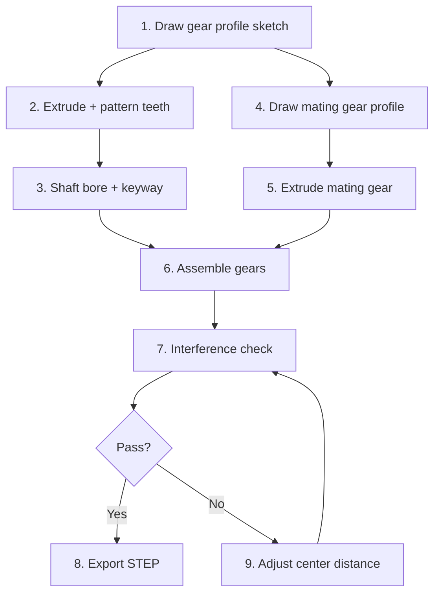
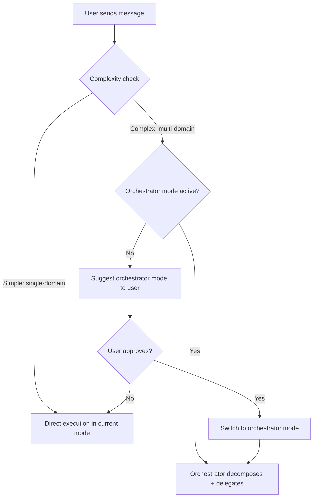
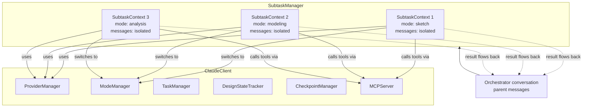
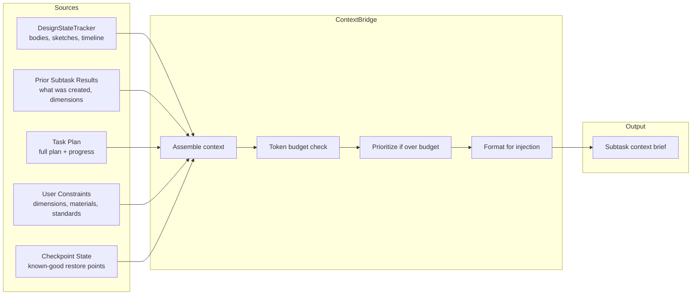
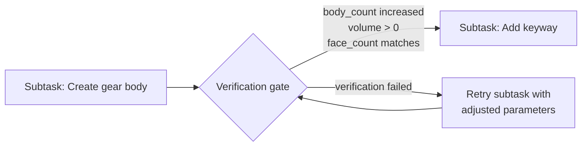
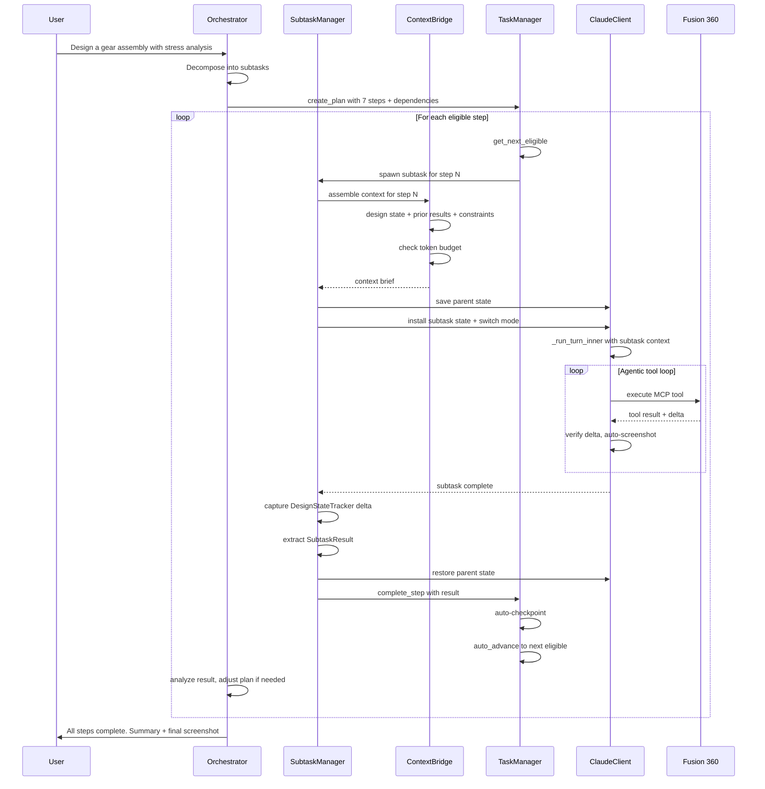

# Orchestrator Adaptation: Roo Code Patterns for Artifex360

## 1. Executive Summary

Artifex360 currently operates as a **single-agent, single-conversation** system. The LLM receives a user request, calls MCP tools in a loop via [`ClaudeClient._run_turn_inner()`](ai/claude_client.py:655), and returns results -- all within one flat conversation thread. Complex multi-step CAD workflows (e.g., "design a gear assembly with stress analysis") depend entirely on the model's ability to self-manage a long chain of tool calls without losing focus, context, or design intent.

This document proposes adapting **Roo Code's orchestrator patterns** -- task decomposition, mode-based delegation, subtask isolation, and result synthesis -- to give Artifex360 a structured orchestration layer. The result is a system where:

- A dedicated **orchestrator mode** decomposes complex requests into discrete CAD subtasks
- Each subtask runs in an **isolated sub-conversation** with a mode-appropriate tool set
- An **active TaskManager** drives execution rather than passively tracking it
- **Context bridging** preserves design state and prior results across subtask boundaries
- **Quality gates** (verification protocol, checkpoints) enforce correctness between steps

The key insight is that Artifex360 already has most of the raw infrastructure -- modes, task tracking, checkpoints, design state tracking, provider abstraction -- but these components are **passive and disconnected**. Orchestration connects them into an active execution pipeline.

---

## 2. Pattern Mapping: Roo Code -> Artifex360

### Pattern 1: Mode-Based Specialization

**Roo Code**: Modes like `code`, `architect`, `ask`, `debug` have distinct file restrictions and system prompts.

**Artifex360 mapping**: The 7 [`CadMode`](ai/modes.py:17) definitions already implement this pattern. Each mode restricts tools via [`tool_groups`](ai/modes.py:26) and injects role-specific instructions via [`custom_instructions`](ai/modes.py:27). The [`ModeManager`](ai/modes.py:177) tracks the active mode and provides [`get_mode_prompt_additions()`](ai/modes.py:224) for system prompt injection.

**What exists**:
- 7 predefined modes with tool restrictions ([`DEFAULT_MODES`](ai/modes.py:54))
- [`ModeManager.switch_mode()`](ai/modes.py:194) for runtime mode changes
- [`ModeManager.add_custom_mode()`](ai/modes.py:220) for registering new modes
- Tool filtering in [`_get_filtered_tools()`](ai/claude_client.py:1261)

**What needs building**:
- An `orchestrator` mode with coordination-specific tools (plan, delegate, verify)
- Tool restrictions that prevent the orchestrator from directly calling CAD tools (it delegates instead)
- Mode-specific rules directory: `config/rules-orchestrator/`

**CAD example** -- "Design a gear assembly with stress analysis":
The orchestrator mode receives the request. It cannot call `create_sketch` or `extrude` directly. Instead, it creates a plan and delegates: sketch mode draws the gear profile, modeling mode extrudes and patterns teeth, assembly mode organizes components, analysis mode runs stress checks.

---

### Pattern 2: Task Delegation via Subtasks

**Roo Code**: The orchestrator uses `new_task` to spawn isolated subtasks in specific modes. Each subtask gets comprehensive context and reports back via `attempt_completion`.

**Artifex360 mapping**: The [`TaskManager`](ai/task_manager.py:65) already tracks [`DesignTask`](ai/task_manager.py:27) steps with statuses, but tasks are inert data -- they don't spawn execution. The [`ClaudeClient`](ai/claude_client.py:134) owns a single conversation history ([`conversation_history`](ai/claude_client.py:157)) with no concept of sub-conversations.

**What exists**:
- [`TaskManager.create_plan()`](ai/task_manager.py:118) creates step lists
- [`TaskManager.start_step()`](ai/task_manager.py:126) / [`complete_step()`](ai/task_manager.py:141) manage lifecycle
- [`DesignTask.result`](ai/task_manager.py:35) field stores completion output
- The agentic loop in [`_run_turn_inner()`](ai/claude_client.py:655) already handles tool chaining

**What needs building**:
- `SubtaskManager` class that creates isolated conversation contexts per step
- A mechanism for subtasks to "report back" (analogous to `attempt_completion`)
- Integration between `SubtaskManager` and the existing agentic loop
- Conversation isolation: subtasks get their own message history but share the same `ClaudeClient` infrastructure

**CAD example** -- "Design a gear assembly with stress analysis":
Step 2 ("Extrude and pattern gear teeth") spawns a subtask in `modeling` mode. That subtask receives: "Create a spur gear body from the sketch 'GearProfile' on the XY plane. Extrude 1cm. Use a circular pattern of 24 teeth. The pitch diameter is 4.8cm." The subtask runs its own tool-call loop, creates the geometry, and returns: "Created body 'SpurGear' with 24 teeth, 4.8cm pitch diameter, 1cm face width, 48 faces."

---

### Pattern 3: Todo List Tracking

**Roo Code**: The orchestrator maintains a markdown checklist with `[ ]`, `[-]`, `[x]` markers, updated after each subtask completes.

**Artifex360 mapping**: This is **already implemented**. [`TaskManager.to_markdown()`](ai/task_manager.py:176) renders the exact same checklist format. [`DesignTask.to_markdown()`](ai/task_manager.py:51) produces `[x]`, `[-]`, `[ ]`, `[!]`, `[~]` markers. [`get_context_injection()`](ai/task_manager.py:197) injects this into the system prompt.

**What exists**:
- Complete markdown checklist rendering with matching status markers
- Context injection into the system prompt via [`_build_effective_prompt()`](ai/claude_client.py:1245)
- Progress tracking via [`TaskManager.progress`](ai/task_manager.py:97)
- REST API for task management at `/api/tasks` ([`web/routes.py:338`](web/routes.py:338))

**What needs building**:
- Automatic status updates when subtasks start/complete (currently manual via REST API)
- WebSocket emission of plan updates so the UI reflects real-time progress
- Dependency graph between steps (currently a flat ordered list)

**CAD example**: After the gear body subtask completes, the orchestrator updates the plan:
```
[x] Create gear tooth profile sketch (24-tooth spur gear, module 2)
[x] Extrude and pattern gear teeth (body: SpurGear, 48 faces)
[-] Create shaft bore and keyway
[ ] Create mating gear (1:2 ratio)
[ ] Assemble gears with proper center distance
[ ] Run interference check
[ ] Export assembly as STEP
```

---

### Pattern 4: Context Bridging

**Roo Code**: Since subtasks are isolated, the orchestrator explicitly passes all needed context in the `message` parameter -- results from previous subtasks, file contents, architectural decisions, constraints.

**Artifex360 mapping**: The [`DesignStateTracker`](ai/design_state_tracker.py:22) already maintains a structured model of bodies, sketches, timeline position, and component count. Its [`to_summary_string()`](ai/design_state_tracker.py:140) produces compact state descriptions. The [`CheckpointManager`](ai/checkpoint_manager.py:30) links F360 timeline state to conversation state.

**What exists**:
- [`DesignStateTracker.to_dict()`](ai/design_state_tracker.py:135) -- full state snapshot
- [`DesignStateTracker.get_delta()`](ai/design_state_tracker.py:180) -- change detection between snapshots
- [`DesignStateTracker.to_summary_string()`](ai/design_state_tracker.py:140) -- compact text for context injection
- [`ContextManager`](ai/context_manager.py:34) for token estimation and condensation
- [`DesignTask.result`](ai/task_manager.py:35) field to store subtask outcomes

**What needs building**:
- A `ContextBridge` that assembles subtask context from: design state, prior subtask results, task plan, and CAD-specific constraints
- Token budget management: the orchestrator must decide how much context each subtask can receive based on [`ContextManager.estimate_tokens()`](ai/context_manager.py:61)
- Result extraction: parsing subtask completion messages into structured data (body names, dimensions, parameter values) for passing forward

**CAD example**: When the "Create mating gear" subtask starts, the context bridge assembles:
- Design state: "3 bodies [SpurGear (vol=12.5cm3, 48 faces), Shaft (vol=2.1cm3, 8 faces), Keyway_cut (vol=0.3cm3, 12 faces)]"
- Prior results: "SpurGear has 24 teeth, module 2, pitch diameter 4.8cm, face width 1cm"
- Constraints: "Mating gear must have 48 teeth (1:2 ratio), same module. Center distance = (24+48)/2 * 2mm = 7.2cm"

---

### Pattern 5: Result Synthesis

**Roo Code**: When subtasks complete, the orchestrator analyzes results, determines next steps, and can spawn additional subtasks dynamically.

**Artifex360 mapping**: The existing [`_run_turn_inner()`](ai/claude_client.py:655) loop processes tool results and decides whether to continue. The verification protocol in [`system_prompt.py`](ai/system_prompt.py:76) already defines how to analyze tool outcomes. Delta checking (bodies_added, volume changes, face counts) in the agentic loop (lines [1036-1146](ai/claude_client.py:1036)) provides structured outcome data.

**What exists**:
- Rich tool result processing with delta verification
- Error classification via [`enrich_error()`](ai/claude_client.py:929)
- Repetition detection via [`RepetitionDetector`](ai/repetition_detector.py)
- Auto-recovery (undo + retry) on geometry errors

**What needs building**:
- Post-subtask analysis: the orchestrator LLM call that reviews a subtask result and decides next steps
- Dynamic plan adjustment: adding/removing/reordering steps based on subtask outcomes
- Failure escalation: when a subtask fails after retries, the orchestrator decides whether to skip, retry with different parameters, or abort

**CAD example**: The interference check subtask reports: "Bodies SpurGear and MatingGear overlap by 0.02cm at the tooth mesh region." The orchestrator analyzes this, determines the center distance needs adjustment, and spawns a corrective subtask: "Move MatingGear component +0.02cm along X axis to eliminate interference."

---

### Pattern 6: Mode Selection Intelligence

**Roo Code**: The orchestrator chooses which mode to delegate to based on the nature of each subtask (planning -> architect, code changes -> code, etc.).

**Artifex360 mapping**: Artifex has 7 domain-specific modes, each with clear scope defined by [`tool_groups`](ai/modes.py:26). Mode selection for CAD tasks is more deterministic than for software engineering -- the task vocabulary maps directly to modes.

**What exists**:
- Clear mode definitions with tool boundaries
- [`ModeManager.list_modes()`](ai/modes.py:212) for available modes
- Mode prompt additions via [`get_mode_prompt_additions()`](ai/modes.py:224)

**What needs building**:
- Heuristic mapping: keyword/intent -> mode (e.g., "sketch" -> sketch, "extrude" -> modeling, "export" -> export)
- LLM-based mode selection for ambiguous tasks
- Multi-mode steps: some subtasks might need to start in one mode and transition (e.g., sketch -> modeling for a sketch-then-extrude operation)
- Mode selection validation: ensuring the selected mode has the tools needed for the subtask

**CAD example** -- automatic mode mapping:

| Subtask description | Selected mode | Rationale |
|---|---|---|
| Draw gear tooth involute profile | `sketch` | 2D geometry creation |
| Extrude gear body, pattern teeth | `modeling` | 3D feature operations |
| Organize into components, apply materials | `assembly` | Component management |
| Measure distances, check interference | `analysis` | Read-only inspection |
| Export final assembly as STEP | `export` | File output |
| Generate parametric gear script | `scripting` | Custom Python code |

---

### Pattern 7: Workflow Management

**Roo Code**: The orchestrator breaks complex requests into logically ordered subtasks, manages dependencies, and adjusts dynamically.

**Artifex360 mapping**: The [`TASK_DECOMPOSITION_PROTOCOL`](ai/system_prompt.py:178) in the system prompt already instructs the agent to plan multi-step workflows. The [`TaskManager`](ai/task_manager.py:65) tracks ordered steps. However, there is no dependency graph or automatic progression.

**What exists**:
- Ordered step list in [`TaskManager._tasks`](ai/task_manager.py:69)
- Step lifecycle: PENDING -> IN_PROGRESS -> COMPLETED/FAILED/SKIPPED
- [`TaskManager.is_complete`](ai/task_manager.py:89) property
- Context injection of the plan into the system prompt

**What needs building**:
- Dependency graph: steps can declare prerequisites (e.g., "extrude" depends on "sketch")
- Parallel execution detection: independent steps could potentially run concurrently (though CAD operations are inherently sequential in a single F360 document)
- Automatic progression: [`complete_step()`](ai/task_manager.py:141) triggers [`start_step()`](ai/task_manager.py:126) for the next eligible step
- Plan revision: the orchestrator can insert, remove, or reorder steps mid-execution

**CAD example** -- dependency graph for "gear assembly with stress analysis":



Steps 1-3 and 4-5 can proceed in parallel conceptually (though F360 is single-threaded). Step 6 depends on both branches completing.

---

## 3. Proposed Architecture

### 3a. Orchestrator Mode

A new [`CadMode`](ai/modes.py:17) registered via [`ModeManager.add_custom_mode()`](ai/modes.py:220):

```python
# Proposed addition to ai/modes.py (or registered at startup)
CadMode(
    slug="orchestrator",
    name="Orchestrator Mode",
    role_definition=(
        "You are the Artifex360 Orchestrator. You coordinate complex, "
        "multi-step CAD design workflows by decomposing requests into "
        "discrete subtasks, delegating each to the appropriate specialist "
        "mode, and synthesizing results. You do NOT call CAD tools directly "
        "-- you plan, delegate, verify, and report."
    ),
    tool_groups=["query", "vision"],  # Read-only + orchestration tools
    custom_instructions=ORCHESTRATOR_INSTRUCTIONS,  # See Section 3e
)
```

**How it differs from `full` mode**:

| Aspect | `full` mode | `orchestrator` mode |
|---|---|---|
| Tool access | All tool groups | `query` + `vision` + orchestration pseudo-tools |
| Direct CAD operations | Yes | No -- delegates to subtasks |
| Conversation scope | Single flat thread | Parent + isolated subtask threads |
| Task management | Passive tracking | Active driving |
| System prompt | General-purpose | Decomposition + delegation focused |

**Activation strategy**:

1. **Manual**: User clicks "Orchestrator" in the mode selector UI or issues a command
2. **Auto-detection** (Phase 3): When the user's request matches complexity heuristics:
   - Contains multiple distinct operations ("sketch a gear, then extrude it, then add fillets, then export")
   - References multiple CAD domains (sketch + modeling + analysis)
   - Uses words like "assembly", "workflow", "process", "complete design"
   - The pre-processing hook in [`run_turn()`](ai/claude_client.py:624) analyzes the request before delegating



---

### 3b. Subtask Engine

The core new component: a `SubtaskManager` class that creates, executes, and collects results from isolated sub-conversations.

**New file: `ai/subtask_manager.py`**

```
Class: SubtaskManager
    - parent_client: ClaudeClient  (shared infrastructure)
    - active_subtasks: dict[str, SubtaskContext]
    - completed_results: dict[str, SubtaskResult]

Class: SubtaskContext
    - id: str
    - mode: str
    - messages: list[dict]       # Isolated conversation history
    - context_brief: str          # Assembled by ContextBridge
    - design_state_before: dict   # Snapshot from DesignStateTracker
    - status: SubtaskStatus

Class: SubtaskResult
    - id: str
    - success: bool
    - summary: str               # LLM-generated or extracted
    - design_state_after: dict
    - delta: dict                # What changed
    - artifacts: dict            # Body names, parameter values, etc.
```

**How subtasks share ClaudeClient infrastructure but isolate conversations**:



**Subtask execution flow -- integration with the existing agentic loop**:

The key design decision is to **reuse** [`_run_turn_inner()`](ai/claude_client.py:655) rather than duplicate it. The subtask engine temporarily swaps the conversation state:

1. Save current state: `saved_history = self.conversation_history`, `saved_mode = self.mode_manager.active_slug`
2. Install subtask state: `self.conversation_history = subtask.messages`, `self.switch_mode(subtask.mode)`
3. Rebuild system prompt with subtask-specific context via [`_build_effective_prompt()`](ai/claude_client.py:1245)
4. Run the agentic loop: `self._run_turn_inner(subtask.context_brief, on_event=subtask_emitter)`
5. Capture result: extract the final assistant message as the subtask result
6. Restore parent state: `self.conversation_history = saved_history`, `self.switch_mode(saved_mode)`

**Subtask result flow**:

When a subtask's agentic loop completes (no more tool calls, stop_reason is `end_turn`), the `SubtaskManager`:

1. Captures the final assistant text as the "completion report"
2. Takes a [`DesignStateTracker`](ai/design_state_tracker.py:22) snapshot and computes the delta against the pre-subtask snapshot
3. Extracts structured artifacts (body names, dimensions) from tool results
4. Packages everything into a `SubtaskResult`
5. Returns control to the orchestrator conversation
6. Injects the result summary into the orchestrator's context for the next decision

**Concurrency model**: Subtasks execute **sequentially** because:
- F360 operations are inherently sequential (single design timeline)
- The [`_turn_lock`](ai/claude_client.py:161) prevents concurrent turns
- The LLM provider connection is shared

---

### 3c. Active TaskManager

Evolving [`TaskManager`](ai/task_manager.py:65) from a passive data structure to an active execution driver.

**New capabilities added to `ai/task_manager.py`**:

```
Extended DesignTask fields:
    - mode_hint: str              # Suggested mode for this step
    - dependencies: list[int]     # Indices of prerequisite steps
    - context_requirements: list[str]  # What context this step needs
    - subtask_result: SubtaskResult | None
    - checkpoint_name: str | None # Auto-checkpoint after completion

New TaskManager methods:
    - get_next_eligible() -> DesignTask | None
        # Returns next PENDING step whose dependencies are all COMPLETED
    - auto_advance() -> DesignTask | None
        # Called after complete_step(); starts next eligible step
    - add_step(description, after_index, mode_hint) -> DesignTask
        # Dynamic plan modification
    - remove_step(index) -> bool
    - reorder_steps(new_order: list[int]) -> None
    - get_dependency_graph() -> dict
    - select_mode_for_step(step: DesignTask) -> str
        # Heuristic mode selection based on step description
```

**Dependency management**:

```python
# Example: creating a plan with dependencies
task_manager.create_plan("Gear Assembly", [
    "Draw gear tooth profile sketch",           # 0: no deps
    "Extrude and pattern gear teeth",            # 1: depends on 0
    "Create shaft bore and keyway",              # 2: depends on 1
    "Draw mating gear profile",                  # 3: no deps (parallel with 0)
    "Extrude mating gear",                       # 4: depends on 3
    "Assemble gears at correct center distance", # 5: depends on 2, 4
    "Run interference check",                    # 6: depends on 5
    "Export assembly as STEP",                   # 7: depends on 6
])
task_manager.set_dependencies(1, [0])
task_manager.set_dependencies(2, [1])
task_manager.set_dependencies(4, [3])
task_manager.set_dependencies(5, [2, 4])
task_manager.set_dependencies(6, [5])
task_manager.set_dependencies(7, [6])
```

**Automatic progression**:

When [`complete_step()`](ai/task_manager.py:141) is called, a new lifecycle hook fires:

```
complete_step(index, result)
    -> mark step COMPLETED
    -> save SubtaskResult
    -> auto-checkpoint if configured
    -> emit "step_completed" event
    -> call auto_advance()
        -> find next eligible step (dependencies satisfied)
        -> mark it IN_PROGRESS
        -> emit "step_started" event
        -> return the step to SubtaskManager for execution
```

**Mode auto-selection per step**:

A heuristic mapper in `TaskManager.select_mode_for_step()`:

| Keywords in step description | Selected mode |
|---|---|
| sketch, profile, draw, 2D, curve, constraint | `sketch` |
| extrude, revolve, fillet, chamfer, pattern, mirror, 3D, body | `modeling` |
| component, assemble, material, joint, organize | `assembly` |
| measure, validate, check, inspect, analyze, interference | `analysis` |
| export, STL, STEP, F3D, output | `export` |
| script, code, Python, parametric, custom | `scripting` |
| (ambiguous / multi-domain) | `full` |

---

### 3d. Context Bridge

**New file: `ai/context_bridge.py`**

The Context Bridge assembles the context payload for each subtask, drawing from multiple sources:



**What state flows between subtasks**:

1. **Design state snapshot** -- from [`DesignStateTracker.to_summary_string()`](ai/design_state_tracker.py:140): current bodies, sketches, timeline position
2. **Prior subtask results** -- the `SubtaskResult.summary` and `SubtaskResult.artifacts` from completed steps
3. **Task plan context** -- the full markdown checklist from [`TaskManager.to_markdown()`](ai/task_manager.py:176) showing what has been done and what remains
4. **CAD-specific parameters** -- dimensions, material choices, tolerances extracted from user request and prior results
5. **Checkpoint references** -- names of available restore points from [`CheckpointManager.list_all()`](ai/checkpoint_manager.py:181)

**DesignStateTracker integration**:

Before each subtask starts, the `ContextBridge`:
1. Calls [`DesignStateTracker.update(mcp_server)`](ai/design_state_tracker.py:61) to refresh from F360
2. Takes a snapshot via [`to_dict()`](ai/design_state_tracker.py:135)
3. Stores it as `SubtaskContext.design_state_before`
4. Includes [`to_summary_string()`](ai/design_state_tracker.py:140) in the subtask's context brief

After each subtask completes:
1. Refreshes state again
2. Computes delta via [`get_delta(pre_snapshot)`](ai/design_state_tracker.py:180)
3. Stores as `SubtaskResult.delta`
4. Includes delta summary in the context for the next subtask

**Token budget management**:

The [`ContextManager.estimate_tokens()`](ai/context_manager.py:61) method is used to ensure subtask context stays within bounds:

```
Total budget for subtask = model context window - system prompt tokens - tool definitions - safety margin

Context priority order (cut from bottom when over budget):
1. [CRITICAL] Step description + mode instructions (never cut)
2. [CRITICAL] Current design state summary (never cut)
3. [HIGH] Results from immediately preceding step
4. [MEDIUM] Full task plan markdown
5. [MEDIUM] Results from all prior steps (condensed)
6. [LOW] User's original full request text
7. [LOW] Checkpoint history
```

The [`ContextManager._context_window`](ai/context_manager.py:39) and [`CONDENSE_THRESHOLD`](ai/context_manager.py:27) settings (65% of context window) apply to subtask conversations as well, ensuring each subtask has room for its own tool-call loop without triggering premature condensation.

---

### 3e. Orchestration Prompt

Additions to the system prompt when in orchestrator mode, injected via [`_build_effective_prompt()`](ai/claude_client.py:1245).

**Task decomposition instructions specific to CAD workflows**:

```markdown
## Orchestrator Protocol

You are the Artifex360 Orchestrator. Your role is to decompose complex CAD
design requests into discrete, executable subtasks and delegate each to the
appropriate specialist mode.

### Decomposition Rules
1. Each subtask should produce a SINGLE verifiable outcome
   (one body, one sketch, one export -- not multiple)
2. Group related operations into the SAME subtask when they share context
   (e.g., "create sketch + extrude" is one modeling subtask, not two)
3. Always include a verification step after geometry-creating subtasks
4. Insert checkpoints after irreversible operations
5. Plan for failure: include fallback steps or retry strategies

### CAD Workflow Patterns
- Sketch-Model-Verify: draw profile -> extrude/revolve -> check dimensions
- Component Assembly: create parts -> organize into components -> add joints
- Analysis Pipeline: create geometry -> validate -> measure -> report
- Export Pipeline: validate design -> apply materials -> export format

### Quality Gates
Between major phases, insert verification subtasks:
- After sketching: verify profile_count > 0, closed profiles
- After modeling: verify body dimensions match spec, take screenshot
- After assembly: run validate_design, check interference
- Before export: final validation + screenshot for documentation
```

**Mode selection heuristics for CAD tasks** (injected into the orchestrator's system prompt):

```markdown
### Mode Selection Guide
| Task involves... | Delegate to |
|---|---|
| Creating 2D geometry, constraints, dimensions | sketch |
| Extruding, revolving, filleting, creating 3D features | modeling |
| Components, joints, materials, assemblies | assembly |
| Measuring, validating, inspecting, reporting | analysis |
| Exporting files (STL, STEP, F3D) | export |
| Custom Python scripts, parametric operations | scripting |
| Tasks spanning multiple domains | full |

### Multi-Mode Subtasks
Some operations naturally span modes. Handle these by:
1. Splitting into sequential single-mode subtasks, OR
2. Using `full` mode when the operations are tightly coupled

Example: "Create a parametric gear" might use scripting mode (single subtask)
rather than sketch -> modeling (two subtasks), because the gear math is
complex enough to warrant a single script.
```

---

## 4. Integration Points

### Existing Files Requiring Modification

| File | Changes | Purpose |
|---|---|---|
| [`ai/modes.py`](ai/modes.py) | Add `orchestrator` mode to [`DEFAULT_MODES`](ai/modes.py:54) | Register the new mode |
| [`ai/task_manager.py`](ai/task_manager.py) | Add dependency graph, auto-advance, mode hints | Active task management |
| [`ai/claude_client.py`](ai/claude_client.py) | Add `SubtaskManager` integration, subtask execution flow | Subtask lifecycle |
| [`ai/claude_client.py`](ai/claude_client.py) | Modify [`_build_effective_prompt()`](ai/claude_client.py:1245) for orchestrator context | Orchestration prompt injection |
| [`ai/claude_client.py`](ai/claude_client.py) | Add pre-processing hook in [`run_turn()`](ai/claude_client.py:624) | Auto-detect complex requests |
| [`ai/system_prompt.py`](ai/system_prompt.py) | Add orchestrator-specific protocol sections | Orchestration instructions |
| [`ai/design_state_tracker.py`](ai/design_state_tracker.py) | Add snapshot comparison utilities | Cross-subtask state tracking |
| [`web/events.py`](web/events.py) | Add orchestration event emissions | Real-time UI updates |
| [`web/routes.py`](web/routes.py) | Add orchestration REST endpoints | API for orchestration control |
| [`mcp/tool_groups.py`](mcp/tool_groups.py) | Add `orchestration` tool group | Orchestrator-specific tools |

### New Files to Create

| File | Purpose |
|---|---|
| `ai/subtask_manager.py` | `SubtaskManager`, `SubtaskContext`, `SubtaskResult` classes |
| `ai/context_bridge.py` | `ContextBridge` class for assembling subtask context |
| `ai/orchestrator_prompt.py` | Orchestrator-specific prompt sections (decomposition rules, mode heuristics) |
| `config/rules-orchestrator/orchestration.md` | Default orchestration rules |
| `tests/test_subtask_manager.py` | Unit tests for subtask lifecycle |
| `tests/test_context_bridge.py` | Unit tests for context assembly and token budgets |
| `tests/test_orchestrator_mode.py` | Integration tests for orchestrated workflows |

### Web UI Exposure

**New UI elements**:
- Orchestrator mode toggle in the mode selector (existing UI at [`web/templates/index.html`](web/templates/index.html))
- Live task plan panel showing the dependency graph with status indicators
- Subtask progress indicators (which subtask is running, in which mode)
- Subtask result cards (expandable summaries of what each subtask accomplished)
- "Override" controls: skip a subtask, retry a subtask, modify the plan

**New REST endpoints** (added to [`web/routes.py`](web/routes.py)):

| Endpoint | Method | Purpose |
|---|---|---|
| `/api/orchestration/plan` | POST | Submit a complex request for orchestrated decomposition |
| `/api/orchestration/plan` | GET | Get the current orchestration plan with dependency graph |
| `/api/orchestration/subtask/<id>` | GET | Get details/results of a specific subtask |
| `/api/orchestration/subtask/<id>/retry` | POST | Retry a failed subtask |
| `/api/orchestration/subtask/<id>/skip` | POST | Skip a subtask and proceed |
| `/api/orchestration/pause` | POST | Pause orchestration after current subtask |
| `/api/orchestration/resume` | POST | Resume paused orchestration |

### WebSocket Events for Orchestration Status

New events emitted via the [`_make_socketio_emitter()`](web/events.py:140) pattern:

| Event | Payload | When |
|---|---|---|
| `orchestration_started` | `{plan_id, total_steps, steps: [...]}` | Orchestrator decomposes request |
| `subtask_started` | `{subtask_id, step_index, mode, description}` | Subtask begins execution |
| `subtask_progress` | `{subtask_id, tool_name, result_summary}` | Tool call within subtask completes |
| `subtask_completed` | `{subtask_id, step_index, success, summary, delta}` | Subtask finishes |
| `subtask_failed` | `{subtask_id, step_index, error, retry_count}` | Subtask encounters unrecoverable error |
| `plan_updated` | `{plan_markdown, progress, current_step}` | Plan status changes |
| `orchestration_completed` | `{plan_id, total_steps, completed, failed, summary}` | All subtasks done |
| `checkpoint_auto_saved` | `{checkpoint_name, step_index, timeline_pos}` | Auto-checkpoint between steps |

---

## 5. Implementation Phases

### Phase 1: Foundation

- Add `orchestrator` mode to [`DEFAULT_MODES`](ai/modes.py:54) with read-only tool access
- Add `orchestration` tool group to [`TOOL_GROUPS`](mcp/tool_groups.py:11)
- Extend [`DesignTask`](ai/task_manager.py:27) with `mode_hint`, `dependencies`, `subtask_result` fields
- Add `get_next_eligible()` and dependency validation to [`TaskManager`](ai/task_manager.py:65)
- Create `config/rules-orchestrator/` directory with default rules
- Create `ai/orchestrator_prompt.py` with decomposition and mode-selection prompt sections
- Write unit tests for all new `TaskManager` methods

### Phase 2: Core Orchestration

- Implement `SubtaskManager` with `SubtaskContext` and `SubtaskResult`
- Implement `ContextBridge` with token budget management
- Modify [`_run_turn_inner()`](ai/claude_client.py:655) to support subtask execution (state save/restore)
- Wire `TaskManager.auto_advance()` to trigger subtask spawning
- Integrate [`DesignStateTracker`](ai/design_state_tracker.py:22) snapshots into subtask lifecycle
- Auto-checkpoint between subtasks via [`CheckpointManager.save()`](ai/checkpoint_manager.py:36)
- Add orchestration WebSocket events to [`web/events.py`](web/events.py)
- Write integration tests for a complete orchestrated workflow (3+ steps)

### Phase 3: Intelligence

- Implement auto-detection of complex requests in [`run_turn()`](ai/claude_client.py:624) pre-processing
- Implement heuristic mode selection in `TaskManager.select_mode_for_step()`
- Add dynamic plan revision (add/remove/reorder steps mid-execution)
- Implement result synthesis: orchestrator LLM call after each subtask to decide next steps
- Add retry logic for failed subtasks with parameter adjustment
- Implement parallel-eligibility detection (future: concurrent subtask execution)
- Provider routing via [`ProviderManager`](ai/providers/provider_manager.py:11): use smaller models for simple subtasks

### Phase 4: UI Integration

- Add orchestrator mode toggle to the web UI mode selector
- Build live task plan panel with dependency graph visualization
- Add subtask progress indicators and result cards
- Implement REST endpoints for orchestration control (pause/resume/skip/retry)
- Add "Override" controls for manual plan modification
- Show token budget usage per subtask
- Display cross-subtask context bridging (what information was passed forward)

---

## 6. CAD-Specific Considerations

### Verification Protocol Integration

The existing [Verification Protocol](ai/system_prompt.py:76) defines post-operation checks (delta verification, volume/face count changes, screenshot confirmation). In an orchestrated workflow, verification becomes a **quality gate** between subtasks:



Each subtask's completion triggers:
1. [`DesignStateTracker.update()`](ai/design_state_tracker.py:61) to refresh state
2. Delta computation via [`get_delta()`](ai/design_state_tracker.py:180)
3. Verification checks: did the expected changes occur?
4. Auto-screenshot (using the existing [`_maybe_auto_screenshot()`](ai/claude_client.py:513) mechanism)
5. Only if verification passes does the orchestrator advance to the next step

### Checkpoint Management Across Subtasks

The [`CheckpointManager`](ai/checkpoint_manager.py:30) links F360 timeline state to conversation state. In orchestrated workflows:

- **Auto-checkpoint** after each successful subtask: `CheckpointManager.save(f"after_step_{index}", ...)`
- **Subtask failure recovery**: restore to the checkpoint before the failed subtask via [`restore()`](ai/checkpoint_manager.py:77)
- **Checkpoint naming convention**: `orchestration_{plan_id}_step_{index}_{mode}`
- The [`DesignCheckpoint.message_index`](ai/checkpoint_manager.py:13) field must reference the **orchestrator's** conversation position, not the subtask's

**Important**: The existing [`restore()`](ai/checkpoint_manager.py:77) method performs F360 timeline rollback (undo operations) AND conversation truncation atomically. For orchestrated workflows, only the timeline rollback is needed -- the subtask's isolated conversation is simply discarded.

### Error Recovery When a Subtask Fails Mid-Workflow

The existing [Error Recovery Protocol](ai/system_prompt.py:99) handles individual tool failures with auto-undo and retry. For orchestration, the error hierarchy is:

1. **Tool-level failure** (handled within the subtask by existing auto-recovery in [`_run_turn_inner()`](ai/claude_client.py:655))
2. **Subtask-level failure** (subtask's agentic loop gives up after max retries):
   - Orchestrator receives failure report
   - Checks if the subtask is retryable (attempts < max_retries)
   - If retryable: restore checkpoint, adjust context (include error info), re-execute
   - If not retryable: mark step FAILED, evaluate if downstream steps can proceed
3. **Plan-level failure** (critical step failed, no viable alternatives):
   - Orchestrator reports to user with: what succeeded, what failed, suggested alternatives
   - Offers to save current state as a checkpoint for manual intervention

### Design State Consistency Across Mode Switches

Each mode switch via [`ModeManager.switch_mode()`](ai/modes.py:194) changes available tools and system prompt. The risk is that a subtask in one mode creates state that the next subtask's mode cannot see or reference correctly. Mitigations:

- [`DesignStateTracker`](ai/design_state_tracker.py:22) is mode-independent -- it always queries the full F360 state
- The `ContextBridge` explicitly passes body names, sketch names, and parameter values between subtasks
- The `query` tool group is available in **all** modes (included in every mode's [`tool_groups`](ai/modes.py:26)), ensuring subtasks can always inspect current state
- Mode switches rebuild the system prompt via [`build_system_prompt()`](ai/system_prompt.py:217), but the task context injection from [`TaskManager.get_context_injection()`](ai/task_manager.py:197) persists across switches

---

## 7. Risks and Mitigations

### Token Budget Concerns

**Risk**: The orchestrator conversation + subtask context + system prompt + tool definitions could exceed the model's context window. Each subtask adds overhead: the context brief, the subtask's own tool-call history, and the result summary that flows back.

**Mitigation**:
- Subtask conversations are **isolated** -- they don't accumulate in the orchestrator's history. Only the result summary is kept.
- The `ContextBridge` enforces token budgets using [`ContextManager.estimate_tokens()`](ai/context_manager.py:61)
- Subtask results are condensed to essential facts (body names, dimensions, success/failure) before being stored in `SubtaskResult.summary`
- The orchestrator's own conversation uses the existing [`ContextManager.condense()`](ai/context_manager.py:185) mechanism if it grows too long
- Worst case for a 200k token window: ~50k system prompt + ~20k orchestrator context + ~130k available for subtask execution -- sufficient for complex workflows

### Latency Impact

**Risk**: Multi-step orchestrated workflows multiply the number of LLM API calls. Each subtask requires at minimum: 1 call for decomposition + N calls per subtask (where N depends on tool chain length) + 1 call for result synthesis.

**Mitigation**:
- Phase 3 introduces model routing via [`ProviderManager`](ai/providers/provider_manager.py:11): use faster/cheaper models (e.g., Haiku via Ollama) for simple subtasks, reserve Opus/Sonnet for complex ones
- Pre-composed tool chains: for common CAD patterns (sketch -> extrude -> verify), provide single-shot instructions that reduce the number of LLM round-trips
- The [`RateLimiter`](ai/rate_limiter.py) already manages API call frequency
- Parallel-eligible subtasks are identified (Phase 3) for future concurrent execution

### Complexity vs. Benefit Tradeoffs

**Risk**: Orchestration adds architectural complexity. For simple requests ("create a box"), the overhead of plan decomposition, subtask spawning, and result synthesis is pure waste.

**Mitigation**:
- Orchestrator mode is **opt-in** (Phase 1-2). The existing single-agent behavior remains the default.
- Auto-detection (Phase 3) only triggers for genuinely complex requests (multi-domain, multiple operations)
- Users can always switch to `full` mode to bypass orchestration entirely
- The `full` mode continues to work exactly as it does today -- zero changes to existing behavior

### Backwards Compatibility

**Risk**: Modifications to [`TaskManager`](ai/task_manager.py:65), [`ClaudeClient`](ai/claude_client.py:134), and other core files could break existing functionality.

**Mitigation**:
- New fields on [`DesignTask`](ai/task_manager.py:27) are optional with defaults (`mode_hint=""`, `dependencies=[]`)
- `SubtaskManager` is a new class that wraps `ClaudeClient`, not a modification of it
- The existing [`run_turn()`](ai/claude_client.py:624) and [`_run_turn_inner()`](ai/claude_client.py:655) signatures do not change
- All new functionality is additive -- existing REST endpoints, WebSocket events, and UI continue to work
- Comprehensive test suite for existing functionality must pass before each phase ships

---

## 8. Key Differences from Roo Code

### What We Should NOT Copy

1. **Fully isolated subtask conversations with no shared state**
   Roo Code subtasks are completely independent -- they start fresh and must be told everything. In CAD, the F360 document IS shared state. Every subtask operates on the same timeline, the same bodies, the same sketches. We should leverage this rather than pretending subtasks are isolated. The `DesignStateTracker` provides the "shared state" that Roo Code lacks.

2. **File-based restrictions per mode**
   Roo Code restricts which files each mode can edit (e.g., architect can only edit `.md`). This makes no sense for CAD -- all modes operate on the same F360 document. Our restriction mechanism is **tool-based** (tool groups per mode), which is already more appropriate and already implemented.

3. **The `attempt_completion` handshake pattern**
   In Roo Code, subtasks must explicitly call `attempt_completion` to report results. This is necessary because subtasks are full conversations with a human-like interaction model. Our subtasks are more like function calls -- they run an agentic loop until done, and the result is simply the final state. We extract the result automatically rather than requiring the LLM to explicitly "complete."

4. **User-in-the-loop for every mode switch**
   Roo Code requires user approval for mode switches via `switch_mode`. In orchestrated CAD workflows, mode switching between subtasks is an internal implementation detail -- the user approved the overall plan, not each individual mode transition.

### CAD-Specific Adaptations Beyond Roo Code

1. **Design state as a first-class context bridge**
   Roo Code has no equivalent of the [`DesignStateTracker`](ai/design_state_tracker.py:22). In Artifex360, the F360 design state (bodies, sketches, timeline, components) provides a rich, structured context bridge that Roo Code must simulate through verbose text. Our subtasks can simply query the current state via `get_body_list`, `get_sketch_info`, etc.

2. **Checkpoint-based failure recovery**
   Roo Code's failure recovery is "tell the user what went wrong." Artifex360 can restore to a known-good state via [`CheckpointManager.restore()`](ai/checkpoint_manager.py:77), which performs atomic F360 timeline rollback + conversation truncation. This enables true retry-with-rollback, not just retry-with-hope.

3. **Verification protocol as quality gates**
   Roo Code trusts subtask results at face value. Artifex360 can independently verify subtask outcomes through the existing [Verification Protocol](ai/system_prompt.py:76): delta checking (did bodies/volume/faces actually change?), measurement verification (`measure_distance`), and visual confirmation (screenshots). This is a significant reliability advantage.

4. **Tool-group isolation is more granular than file-pattern isolation**
   Roo Code's file patterns (`.md$`, `.py$`) are coarse. Artifex360's tool groups ([`TOOL_GROUPS`](mcp/tool_groups.py:11)) provide fine-grained capability isolation: a sketch subtask literally cannot call `extrude` because it is not in the `features` tool group. This prevents mode-inappropriate operations structurally, not just via prompt instructions.

5. **Design timeline as a natural checkpoint mechanism**
   F360's design timeline provides a built-in undo stack that Roo Code has no equivalent for. The orchestrator can use timeline position to:
   - Track exactly what each subtask changed
   - Rollback partial subtask work on failure
   - Provide time-travel debugging ("show the state after step 3")

6. **Provider routing for cost/speed optimization**
   Roo Code uses a single model for all modes. Artifex360's [`ProviderManager`](ai/providers/provider_manager.py:11) supports multiple providers (Anthropic, Ollama). The orchestrator can route simple subtasks (e.g., "take a screenshot and verify body count") to a local Ollama model, reserving expensive API calls for complex reasoning tasks. This is a significant cost optimization unavailable in Roo Code.

### Where Artifex's Existing Infrastructure Provides Advantages

| Artifex Component | Advantage Over Roo Code |
|---|---|
| [`DesignStateTracker`](ai/design_state_tracker.py:22) | Structured, queryable shared state vs. text-only context passing |
| [`CheckpointManager`](ai/checkpoint_manager.py:30) | Atomic rollback + retry vs. hope-based error recovery |
| [Verification Protocol](ai/system_prompt.py:76) | Independent outcome verification vs. trusting subtask self-reports |
| [`ProviderManager`](ai/providers/provider_manager.py:11) | Multi-model routing for cost optimization vs. single-model |
| [Tool groups](mcp/tool_groups.py:11) | Structural capability isolation vs. file-pattern restrictions |
| [`ContextManager`](ai/context_manager.py:34) | Built-in condensation with design state preservation vs. manual context management |
| [Error classifier](ai/error_classifier.py) | Structured error enrichment + auto-recovery vs. raw error messages |
| [`RepetitionDetector`](ai/repetition_detector.py) | Prevents infinite loops within subtasks automatically |

---

## Appendix: End-to-End Flow Diagram

Complete orchestration flow for "Design a gear assembly with stress analysis":


